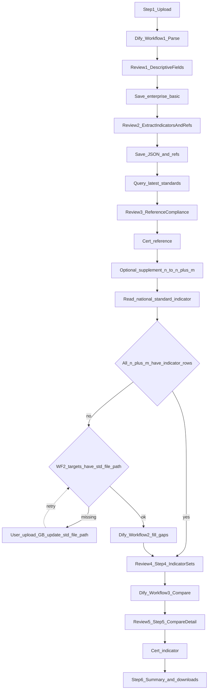

# 合规性评价模块：流程与接口约定（实施口径）

本文档描述**当前版本**前后端对齐的合规评价向导：**前端 6 步**、**人工审核决策 5 次**（第 6 步为汇总与下载，不计入审核轮次）、**Dify 工作流**：① 必跑；② **按需**（仅当国标指标库未命中时）；③ 在审核 4 通过后做对比；引用侧 **n → n+m** 补充规则及证书产出。需求原文仍以根目录《标准化信息服务平台——需求分析文档》8.4 为基线；本文件为工程实施细化。

**开发执行顺序与阶段细节**见 [《合规性评价：开发规划》](./backend-compliance-开发规划.md)。

**关联文档**：[《后端模块开发分工清单》](./backend-模块开发分工清单.md) 中 `apps/compliance` / `apps/engine` 小节；**分阶段落地与完整性验收（F1～F12 简表）**见 [《合规性评价：分阶段实现方案》](./backend-compliance-分阶段实现方案.md)。

---

## 1. 前端六步与人工五审对照

| 步骤 | 用户可见阶段 | 系统行为（摘要） | 人工审核 |
|------|----------------|------------------|----------|
| **1** | 上传企标 | 用户上传企标文件；后端经 `engine` 调用 **Dify 工作流 ①（企标解析）**；返回企标号、企标名称、企业名称、具体指标、规范性引用标准号。前端先展示**企标号、企业名称、企标名称**供核对；**描述性合规证书下载**：当前版本**留白**（接口/字段可预留）。用户确认后后端落库基础字段。 | **审核 1**：描述性关键字段 |
| **2** | 提取信息审核 | 展示工作流输出的两块：**具体指标**、**规范性引用标准号**。用户确认或修正后提交；后端持久化（与 `indicator_set_json`、引用列表等对齐，见第 4 节）。 | **审核 2**：提取结果（指标 + 引用标准号） |
| **3** | 规范性引用合规 | 基于审核 2 的引用标准号，后端查 **`standards`**（谱系/元数据）得到每个引用对应的**当前最新标准号**，与「企标中写明的引用号」一并展示；用户完成判断后，后端生成**规范性引用合规性评价证书**并提供下载。本步结束后允许用户**补充 m 个「最新标准号」**：逻辑上由 **n 个原引用标准号** 对应 **n+m 个最新标准号**（n 条主映射 + m 条补充），后续指标步骤均以 **n+m** 为「最新侧」集合口径。 | **审核 3**：引用合规结论（含可选补充） |
| **4** | 具体指标展示与确认 | 后端汇总 **n 侧引用相关上下文** 与 **n+m 最新侧 std_code** 后，**先查** [`national_standard_indicator`](../v1.0-sql/standards_db_v1.0_national_standard_indicator.sql)（按 `std_code`）：若某标准**已有可用指标**（见下「术语」）则**直接用表内数据**，**不调 Dify ②**。**仅对仍缺、且需要走 Dify ② 补缺的标准**：在调用 Dify ② 之前，再查 [`national_standard_basic`](../v1.0-sql/standards_db_v1.0_national_standard_basic.sql) 中该 `std_code` 的 **`std_file_path`（国标文件保存路径）**；若路径为空或本地文件不存在，则**不调用 Dify ②**，接口向返回**缺文件清单**（如 `std_code`、标准名称等），由前端提示用户**上传该国标文件**；后端落盘存储并**回填/更新 `std_file_path`** 后，用户重试步骤 4 拉取或后端再次编排，**方可继续** Dify ② 与后续具体指标分析。将「各标准侧指标集合」与**步骤 1**的**企标内具体指标**一并返回前端；用户审核确认后进入下一步。 | **审核 4**：指标材料与集合展示 |
| **5** | 指标对比与结论证书 | 用户确认审核 4 后，后端将「企标文件提取指标 + 规范性引用相关指标」与「n+m 个最新标准提取指标」交 **Dify 工作流 ③**做指标对比，得到**对比结果与明细**；前端展示供用户审核；通过后后端出具**指标对比阶段结论证书**。 | **审核 5**：对比结果与明细 |
| **6** | 总结与报告 | 汇总本次评价全流程关键数据与三项评价维度状态；提供**各阶段证书/报告**及总结报告的**下载入口**（与 `archive` 存储路径、鉴权衔接）。 | 流程终态（**非**第六次人工审核） |

**说明**：需求文档中的「一审 / 二审」与本向导的 **审核 1～5** 为不同粒度表述；以本文件六步五审为 API 与状态机拆分依据。

**术语 — 「已有可用指标」（步骤 4）**：指该 `std_code` 在 **`national_standard_indicator`（国标具体指标表）中，已经在此前通过 Dify 工作流解析并保存落库的记录**；步骤 4 命中则**直接复用表内数据**，不再为该标准调用 Dify ②。是否还要求 `specific_indicator_value` 非空、是否与 `manual_review_status` 联动过滤，由实现与 DDL 评审细化。

**术语 — 「国标本地文件缺失」（步骤 4）**：指该 `std_code` 在 **`national_standard_basic` 中 `std_file_path` 为空、或路径指向的文件在存储上不可用**，而当前流程又**需要**依赖本地国标文件做解析（例如调用 Dify ②）时，视为阻断条件；须由用户上传对应国标文件并由后端更新路径后，再继续该标准的指标补缺流程。**若某标准已满足「已有可用指标」**，仅读 `national_standard_indicator` 即可，**不要求**此时仍具备有效 `std_file_path`（除非产品另行要求重解析）。

## 2. Dify 调用与模块边界

| 调用点 | 触发时机 | 职责 |
|--------|----------|------|
| **工作流 ①** | 步骤 1 上传文件后 | PDF/文件解析 → 企标号、名称、企业名、指标、引用标准号等结构化结果 |
| **工作流 ②** | 步骤 4：对 **n+m 最新侧** 中 **`national_standard_indicator` 尚无「已有可用指标」** 的 `std_code` 按需触发（审核 3 已完成，n+m 已定）；**触发前**须校验该国标在 **`national_standard_basic.std_file_path`** 上已有可用本地文件，否则**不调 ②**并走「缺文件 → 用户上传 → 更新路径 → 重试」 | 仅补缺：解析结果**落库**到国标具体指标表；已命中则**不调 ②** |
| **工作流 ③** | 审核 4 通过后、步骤 5 | 企标侧指标 + 引用侧指标 与 n+m 最新侧指标做**对比**，输出结果与明细，供审核 5 |

- **`apps/compliance`**：评价任务/会话状态机、审核闸门、落库、证书路径写入、对前端的聚合读写接口。
- **`apps/engine`**：Dify HTTP 调用、Webhook 回调、run id、重试与幂等、契约 JSON 校验；**不承载**完整业务状态机。
- **`apps/standards`**：按标准号解析「最新有效版本」等只读查询（步骤 3）；步骤 4 **读取/必要时更新** `national_standard_indicator`（与 Dify ② 回写策略在实现期与 DDL 评审对齐）。
- **`apps/archive`**：证书与报告文件存储、下载 URL 或打包（与路径字段配合）。
- **`apps/audit`**：关键实体变更的 Diff 与追加日志（与合规并行迭代）。

长耗时调用建议走异步（`tasks.py` + Redis/Celery），接口层返回任务 id 与轮询/推送方案；骨架阶段可同步 Mock。

---

## 3. 数据落库锚点（与现有 DDL 对齐叙述）

以下与 [`v1.0-sql/`](../v1.0-sql/) 中表对应；**扩表或新增任务表**须走 [《DDL/ORM 对齐职责》](./backend-DDL-ORM-对齐职责.md) 评审。

| 审核完成后 | 建议持久化内容 |
|--------------|----------------|
| 审核 1 | [`enterprise_standard_basic`](../v1.0-sql/standards_db_v1.0_enterprise_standard_basic.sql)：`qb_code`、`qb_name`、`company_name` 等用户确认字段 |
| 审核 2 | `enterprise_standard_basic.indicator_set_json`（及引用列表若放在 JSON 或子表）；与 Dify ① 原始快照可存任务扩展表以便审计 |
| 审核 3 | [`enterprise_standard_reference_mapping`](../v1.0-sql/standards_db_v1.0_enterprise_standard_reference_mapping.sql)：`referenced_std_code`、`latest_std_code`、`manual_review_status`；补充的 m 个最新号可用 `supplement_std_version_code` 或多行扩展策略（需评审） |
| 审核 4 / 5 | [`evaluation_result`](../v1.0-sql/standards_db_v1.0_evaluation_result.sql) 中各维度 enum 与 `*_report_file_path`、`certificate_file_path` 等；若单表不足承载工作流 run 与多版本快照，新增 `compliance_evaluation_task` 类表由评审决定 |
| 步骤 4（Dify ② 补缺后） | [`national_standard_indicator`](../v1.0-sql/standards_db_v1.0_national_standard_indicator.sql)：Dify ② 新解析的指标**写入本表**，即构成后续轮次的「已有可用指标」 |

---

## 4. 证书与报告（产品清单）

| 产物 | 步骤 | 当前状态 |
|------|------|----------|
| 描述性合规证书 | 1 | **留白**（预留下载接口或路径字段） |
| 规范性引用合规性评价证书 | 3 | 已实现目标：审核通过后生成并可下载 |
| 指标对比结论证书 | 5（审核 5 通过后） | 已实现目标 |
| 总结报告 / 全流程信息 | 6 | 聚合展示 + 下载方式与 `archive` 对齐 |

不合规分析报告若与需求 8.4 并列，可在 `evaluation_result` 扩展路径字段或单独 artifact。

---

## 5. 建议路由分组（OpenAPI 分期占位）

均在 **`/api/v1/compliance`** 下扩展（具体路径名可在实现期微调，保持资源语义一致即可）：

- `POST /evaluations`：创建评价任务/会话  
- `POST /evaluations/{id}/upload`：上传企标文件 → 触发 Dify ①  
- `GET /evaluations/{id}/step/1`：审核 1 展示数据；`POST .../step/1/confirm`  
- `GET/POST .../step/2`：审核 2  
- `GET .../reference-latest`、`POST .../step/3/confirm`、`POST .../supplements`：审核 3 与 n+m 补充  
- `GET .../dify-runs`、`POST .../step/4/confirm`、`POST .../step/5/confirm`：审核 4、5（指标展示与对比结果分步确认）  
- `POST .../national-standards/upload`（或 `.../missing-gb-files` + `POST .../upload-national-standard`）：步骤 4 发现 **`std_file_path` 缺失** 时，返回待补全的 `std_code` 列表；用户按标准上传文件后，后端写入 `archive`/合规受控存储并**更新 `national_standard_basic.std_file_path`**（路径策略与鉴权在实现期与 `standards`/`archive` 评审对齐）  
- `GET .../summary`、`GET .../artifacts`：步骤 6 与下载  
- `GET /rules`：规则预置（与需求 8.4 规则节衔接，可二期）

**步骤 4「缺本地国标文件」响应体（建议）**：编排或拉取具体指标时若因 **`std_file_path` 不可用** 无法继续 Dify ②，返回 **HTTP `409`** 或 **`422`**（与全局错误码表统一）；JSON 中带 **`missing_gb_files`**，元素形如 `{ "std_code", "std_name"?, "reason": "empty_std_file_path" | "file_not_found" }`，前端据此提示用户上传；上传成功并更新路径后，**同一评价任务**下重试原步骤 4 相关接口即可继续。

---

## 6. 状态机提示（实现参考）

建议以评价任务实体维护 `current_step`（1～6）与审核闸门状态（例如 `step4_indicators_ok`、`step5_compare_ok`）。每次审核通过写入快照以支持断点恢复（与需求非功能：秒级恢复一致）。

---

## 7. 流程总览（Mermaid）

---

## 8. 修订记录

| 日期 | 说明 |
|------|------|
| 2026-05 | 首版：六步五审、三 Dify、n+m 补充、证书留白与分工对齐 |
| 2026-05 | 步骤 4：国标指标表优先命中，缺再 Dify②；Mermaid 与 §2 同步 |
| 2026-05 | 术语：「已有可用指标」= 曾由 Dify 解析并已写入 `national_standard_indicator` |
| 2026-05 | 步骤 4：`national_standard_basic.std_file_path` 为空则阻断 Dify ②，提示用户上传国标并回填路径；§5 路由占位、Mermaid 增加 `pathGate` / `uploadStd` |
