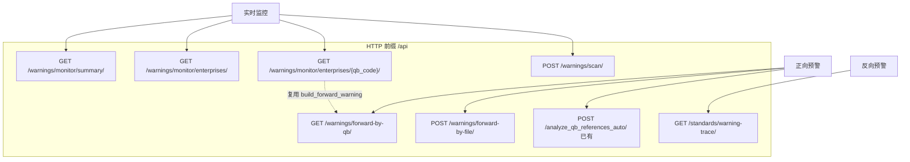
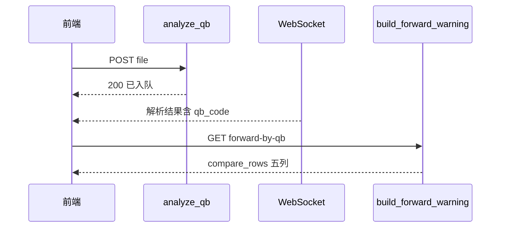
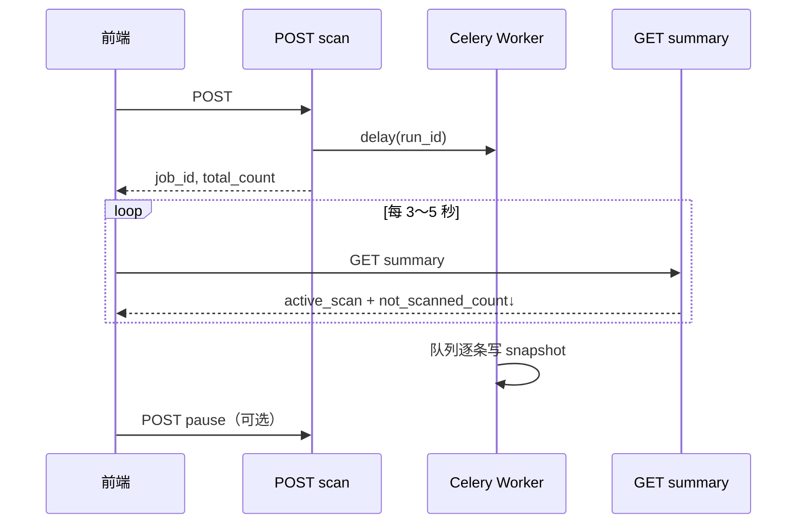
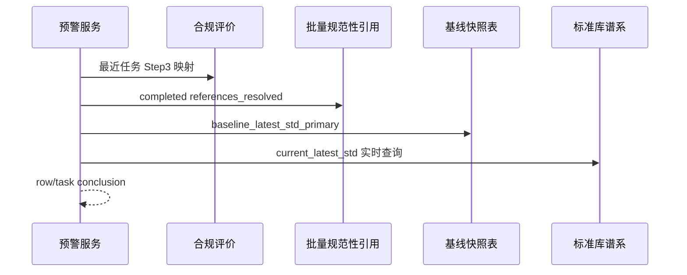

# 预警模块 API — 后端开发执行方案

本文档面向**后端开发**，说明预警系统三个子模块的业务目标、内部数据依赖、HTTP 接口契约、实现分期与联调验收。前端已按本方案对接，实现时请以本文与 [`frontend/src/types/warnings-api.ts`](../frontend/src/types/warnings-api.ts) 为准。

**相关文档**：

| 文档 | 读者 |
|------|------|
| 本文档 | 后端实现、排期、联调 |
| [backend-warnings-API-前端对接手册.md](./backend-warnings-API-前端对接手册.md) | 前端联调速查 |
| [backend-warnings-实时监控-前端改造说明.md](./backend-warnings-实时监控-前端改造说明.md) | **实时监控 Tab 前端改造清单** |
| [backend-novelty-search-API-后端对接手册.md](./backend-novelty-search-API-后端对接手册.md) | 基线快照、行级比对规则 |
| [compliance-module-backend-api-requirements.md](./compliance-module-backend-api-requirements.md) | 合规扩展接口（含旧版 `warning-trace`） |

---

## 第 0 章 总览

### 0.1 业务目标

对系统中**已完成合规性评价或批量规范性引用评价**的企标，按需或定期执行「引用标准再查新」：

1. 取出评价时记录的引用清单与**上次查新/评价时的最新标准号**（基线）；
2. 对每条引用做**实时谱系查新**，得到**本次最新标准号**；
3. 比较基线与本次结果，输出**行级结论**与**任务级预警结论**。

用户通过三个 Tab 使用：

| 顺序 | Tab | 粒度 | 说明 |
|------|-----|------|------|
| 1 | 正向预警 | 单企标 | 输入企标号或上传企标文件，查看五列比对表 |
| 2 | 反向预警 | 单国标 | 输入国标号，查新该国标并列出引用它的企标是否要改 |
| 3 | 实时监控 | 全库 | 汇总已评价企标巡检结果，下钻单企标五列明细 |

### 0.2 接口与子模块映射



### 0.3 全局约定

#### Base URL

```text
http://{host}:{port}/api
```

下文路径均相对于 **`/api`**（与前端 `VITE_API_BASE_URL` 默认 `/api` 一致）。  
查新服务使用独立前缀 `/api/v1/novelty-search`，预警模块**不**要求前端直连查新 API，由预警服务内部调用谱系引擎。

#### 鉴权

与合规模块一致：

```http
Authorization: Bearer <token>
```

由环境变量 `COMPLIANCE_API_AUTH_REQUIRED` 控制是否强制；前端在配置 `VITE_COMPLIANCE_API_TOKEN` 时自动附带。

#### 响应包络

前端 `unwrapData` 支持以下两种成功包络，**任选一种**并保持一致：

**格式 1（推荐，与合规一致）**

```json
{
  "code": 200,
  "msg": "success",
  "data": { }
}
```

**格式 2**

```json
{
  "success": true,
  "data": { }
}
```

失败时建议：

```json
{
  "code": 422,
  "msg": "该企标暂无合规或批量评价记录",
  "data": null
}
```

或 HTTP 4xx/5xx + `{ "detail": "中文说明" }`（Django/DRF 风格）。

#### 时间与标准号

- 时间字段：ISO8601 UTC，例如 `2026-05-23T10:00:00Z`。
- 标准号规范化：与查新/合规一致——去首尾空格、全角连字符归一为 `-`、企标号 `Q/` 与 `Q_` 等等价规则见查新手册 §2.2。比对前对 `baseline_latest_std` 与 `current_latest_std` 做同一规范化函数 `normalize_std_code()`。

#### 核心服务函数（强烈建议）

```python
def build_forward_warning(qb_code: str) -> ForwardWarningResponse:
    """
    正向预警 + 监控明细共用。
    1. 校验是否有合规/批量评价历史
    2. 汇聚引用行
    3. 读基线快照 + 实时查新
    4. 计算 row_conclusion / task_conclusion
    """
```

以下 **接口 A、B、G** 均应调用此函数，避免三处逻辑分叉。

---

## 第 1 章 子模块一 — 正向预警

### 1.1 功能说明

| 项目 | 说明 |
|------|------|
| **用户动作** | ① 输入企标号点击「正向预警」；② 或上传企标 PDF/Word 后「分析预警内容」（两入口并存） |
| **前置条件** | 该企标在库中存在**合规评价**（任务 `current_step >= 4`）或**批量规范性引用**（子项 `status = completed`） |
| **无历史** | 返回 `task_conclusion = empty_history`，`compare_rows` 为空数组；前端只展示说明，不展示表格 |
| **有历史** | 对每条引用输出五列 + 行结论；表顶展示任务级结论 |
| **展示列序（固定）** | ① 企标文件中引用的标准号 → ② 补全之后的引用标准 → ③ 上一次查出的最新标准号 → ④ 本次预警查出的最新标准号 → ⑤ 预警结论 |

#### 任务级结论规则（`task_conclusion`）

| 条件 | `task_conclusion` | `task_summary` 示例 |
|------|-------------------|----------------------|
| 无合规/批量评价记录 | `empty_history` | 未找到该企标的评价记录，无法做基线比对 |
| 任意可比对行 baseline ≠ current | `need_attention` | 存在 N 条引用标准与上次查新结果不一致，建议核对企标 |
| 全部可比对行相等，且无 `updated` | `all_ok` | 引用标准均无变化，状态良好，暂不需更新 |
| 含 `unresolved`/`not_assessable` 且仍有其他可比对行 | `partial` | 共 M 条引用，K 条需人工核对 |
| 文件解析尚未完成 | `pending` | 正在解析企标文件，请稍候 |

#### 行级结论规则（`row_conclusion`）

与查新模块**完全一致**（勿使用 `need_update` 等其它字符串）：

| `row_conclusion` | 条件 | `row_conclusion_label` 建议 |
|----------------|------|----------------------------|
| `unchanged` | baseline、current 均非空且规范化后相等 | 无变化 |
| `updated` | 均非空且不等 | 需更新 / 标准已更新 |
| `first_record` | baseline 为空、current 非空 | 首次建立基线 |
| `unresolved` | current 为空 | 无法解析现行号 |
| `not_assessable` | 该条 `compliance_assessable === false` | 不可自动比对 |

### 1.2 内部数据依赖（非 HTTP）

| 输出字段 | 建议数据来源 |
|----------|----------------|
| `referenced_std_code` | 合规 Step3 映射表 / 批量 `reference_resolution_json[].referenced_std_code`；按规范化去重 |
| `full_std_at_publication` | **评价落库快照**：合规 `get_reference_latest_bundle`、批量 `reference_resolution_json[].full_std_at_publication`；多条历史取**最近一条**非空 |
| `baseline_latest_std` | 优先 **`novelty_reference_baseline_snapshot.baseline_latest_std_primary`**（键 `(qb_code, referenced_std_code)`，只读）；无基线时回退为评价时的 `latest_std_primary` |
| `current_latest_std` | **仅对国标**调用 `resolve_latest_for_code` 实时谱系查新；**不经过**查新模块 `missing_enterprise_qb_code`（Q/ 企标号闸门） |
| `source_evaluations[]` | 列出参与汇聚的合规任务 ID / 批量子项 ID 及时间 |

**实现说明**：预警使用 `apps.alerting.services.warning_compare.build_warning_compare_rows`，输入为 `find_history_for_qb_code` 汇聚的 `eval_reference_rows`（评价结果只读）。查新模块仍使用 `build_compare_rows` + `reference_sheet_rows`，二者互不替代。企标号格式（如 `CPJ.207.003-2024` 非 `Q/` 前缀）**不影响**预警五列填充，只要批量/合规评价曾写入引用解析 JSON 即可。

**基线表**（与查新共用，见查新手册 §2.3）：

| 字段 | 说明 |
|------|------|
| `qb_code` | 企标号（规范化） |
| `referenced_std_code` | 引用号（规范化） |
| `baseline_latest_std_primary` | 首次写入时的主现行号 |
| `baseline_recorded_at` | 写入时间 |
| `baseline_source` | `compliance` \| `batch` |
| `baseline_source_id` | `evaluation_task_id` 或 `batch_item_id` |

写入时机（查新模块已定义，预警**不写入**）：合规 Step3 confirm 成功、批量子项 completed。

**历史汇聚条件**（与查新 `POST /tasks` 一致，供 `build_forward_warning` 判断是否有历史）：

| 来源 | 条件 |
|------|------|
| 合规 | `compliance_evaluation_task.qb_code` 匹配且 `current_step >= 4` |
| 批量 | `batch_normative_reference_item.status = completed` 且解析结果中企标号匹配 |

### 1.3 接口 A — 企标号正向预警

| 项目 | 值 |
|------|-----|
| **路径** | `GET /api/warnings/forward-by-qb/` |
| **说明** | 正向预警主入口；监控明细与之同结构 |

#### 请求

| 位置 | 参数 | 类型 | 必填 | 说明 |
|------|------|------|------|------|
| Query | `qb_code` | string | 是 | 企标号，如 `Q/XXX 001-2020` |

#### cURL 示例

```bash
curl -G "http://127.0.0.1:8000/api/warnings/forward-by-qb/" \
  --data-urlencode "qb_code=Q/XXX 001-2020" \
  -H "Authorization: Bearer YOUR_TOKEN"
```

#### 成功响应 `data` 字段表

| 字段 | 类型 | 必填 | 说明 |
|------|------|------|------|
| `qb_code` | string | 是 | 规范化后的企标号 |
| `enterprise_name` | string \| null | 否 | 企业名称 |
| `task_conclusion` | string | 是 | 见 §1.1 任务级枚举 |
| `task_summary` | string \| null | 否 | 人类可读摘要 |
| `compare_rows` | array | 是 | 无历史时 `[]` |
| `source_evaluations` | array | 否 | 历史来源摘要 |

**`compare_rows[]` 元素**

| 字段 | 类型 | 必填 | 说明 |
|------|------|------|------|
| `id` | string | 建议 | 行 ID，前端作 `rowKey` |
| `referenced_std_code` | string | 是 | 列 1：企标原文引用号 |
| `full_std_at_publication` | string \| null | 否 | 列 2：补全年代号后 |
| `baseline_latest_std` | string \| null | 否 | 列 3：上次查新最新 |
| `current_latest_std` | string \| null | 否 | 列 4：本次预警最新 |
| `row_conclusion` | string | 是 | 列 5 枚举码 |
| `row_conclusion_label` | string | 否 | 列 5 展示文案 |
| `explanation` | string \| null | 否 | 展开行说明 |

**`source_evaluations[]` 元素**

| 字段 | 类型 | 说明 |
|------|------|------|
| `source_type` | `compliance` \| `batch` | 来源类型 |
| `evaluated_at` | string | ISO8601 |
| `job_id` | string \| number | 任务/子项 ID |

#### 成功示例

```json
{
  "code": 200,
  "msg": "success",
  "data": {
    "qb_code": "Q/XXX 001-2020",
    "enterprise_name": "某某有限公司",
    "task_conclusion": "need_attention",
    "task_summary": "存在 2 条引用标准与上次查新结果不一致，建议核对企标",
    "compare_rows": [
      {
        "id": "1",
        "referenced_std_code": "GB/T 1.1",
        "full_std_at_publication": "GB/T 1.1-2020",
        "baseline_latest_std": "GB/T 1.1-2020",
        "current_latest_std": "GB/T 1.1-2024",
        "row_conclusion": "updated",
        "row_conclusion_label": "需更新",
        "explanation": "谱系查询显示现行版本已更新"
      },
      {
        "id": "2",
        "referenced_std_code": "GB 4789.2",
        "full_std_at_publication": "GB 4789.2-2016",
        "baseline_latest_std": "GB 4789.2-2016",
        "current_latest_std": "GB 4789.2-2016",
        "row_conclusion": "unchanged",
        "row_conclusion_label": "无变化"
      }
    ],
    "source_evaluations": [
      {
        "source_type": "compliance",
        "evaluated_at": "2025-11-01T08:30:00Z",
        "job_id": 42
      }
    ]
  }
}
```

#### 无历史示例（HTTP 200 或 422 二选一，推荐 200 + empty_history）

```json
{
  "code": 200,
  "msg": "success",
  "data": {
    "qb_code": "Q/NEW 999-2026",
    "enterprise_name": null,
    "task_conclusion": "empty_history",
    "task_summary": "未找到该企标的合规或批量规范性引用评价记录",
    "compare_rows": [],
    "source_evaluations": []
  }
}
```

#### 错误响应

| HTTP | 场景 | 说明 |
|------|------|------|
| 400 | 缺少 `qb_code` | `detail`: `qb_code is required` |
| 404 | 企标档案不存在（若业务区分） | |
| 503 | 谱系/MySQL 未就绪 | |

---

### 1.4 接口 B — 文件正向预警

| 项目 | 值 |
|------|-----|
| **路径** | `POST /api/warnings/forward-by-file/` |
| **说明** | 上传企标文件并返回与接口 A 相同结构；可与旧解析链路配合 |

#### 请求

| 位置 | 参数 | 类型 | 必填 | 说明 |
|------|------|------|------|------|
| Body (multipart) | `file` | file | 是 | PDF / DOC / DOCX |
| Body (multipart) | `qb_code` | string | 否 | 用户已填企标号时传入，用于关联历史 |

#### cURL 示例

```bash
curl -X POST "http://127.0.0.1:8000/api/warnings/forward-by-file/" \
  -H "Authorization: Bearer YOUR_TOKEN" \
  -F "file=@/path/to/enterprise_std.pdf" \
  -F "qb_code=Q/XXX 001-2020"
```

#### 成功响应

`data` 结构与**接口 A**完全相同。

#### 异步实现建议

若文件解析耗时：

1. 先返回 `task_conclusion: pending`、`compare_rows: []`、`job_id`（可放在 `task_summary` 或扩展字段）；
2. 解析完成并识别 `qb_code` 后，内部调用 `build_forward_warning(qb_code)`；
3. 或依赖 **接口 C + WebSocket**，由前端再调 **接口 A**。

---

### 1.5 接口 C — 企标文件解析入队（已有，保留）

| 项目 | 值 |
|------|-----|
| **路径** | `POST /api/analyze_qb_references_auto/` |
| **Content-Type** | `multipart/form-data` |
| **Body** | `file`（必填） |

#### 成功响应（当前形态，可保留）

```json
{
  "code": 200,
  "msg": "文件已成功移交后台 AI 引擎，解析完成后将通过 WebSocket 推送"
}
```

#### WebSocket

| 项目 | 值 |
|------|-----|
| 路径示例 | `ws://{host}/ws/dify_results/` 或 `ws://{host}/ws/dify_notifications/` |
| 推送内容 | 含 `results` / `referenced_standards` 等引用数组 |

**集成要求**：解析出企标号后，应能关联 `build_forward_warning`；**禁止**长期仅返回废止/现行卡片 JSON，前端已改为五列表格。

#### 推荐链路



---

## 第 2 章 子模块二 — 反向预警

### 2.1 功能说明

| 步骤 | 后端逻辑 |
|------|----------|
| 1 | 用户输入国标标准号 `bz_id` |
| 2 | 在合规/批量历史中检索**引用过该国标**（规范化匹配，含谱系等价）的企标列表 |
| 3 | 对该国标执行查新：`input_bz` → `latest_bz`，计算 `gb_updated` |
| 4 | 若国标无更新：`task_conclusion = all_ok`，各企标 `enterprise_need_modify = false` |
| 5 | 若国标有更新：对每个关联企标判断其引用链路上次记录 vs 本次是否需改 → `enterprise_need_modify` |

**前端展示顺序**（自上而下）：任务总结论 → 国标查新块 → 涉及企标更替列表。

### 2.2 企标「需修改」判定（后端负责）

默认规则（可实现为配置）：

1. `gb_novelty.gb_updated === true`；
2. 且该企标在针对该国标（或其替代链）的比对中，存在 `row_conclusion === updated`，或评价快照中该国标相关行的 baseline 与本次 `latest_bz` 不一致。

扩展：国标状态为**废止**、**即将实施**时，`status_label` 与 `enterprise_need_modify` 可与合规 `reference-latest` 一致，由标准库状态字段驱动。

### 2.3 接口 D — 反向预警（扩展现有 warning-trace）

| 项目 | 值 |
|------|-----|
| **路径** | `GET /api/standards/warning-trace/` |
| **现状** | 多返回 `input_bz`、`latest_bz`、`affected_enterprises: string[]` |
| **目标** | 扩展为结构化响应，**联调验收以目标为准** |

#### 请求

| 位置 | 参数 | 类型 | 必填 | 说明 |
|------|------|------|------|------|
| Query | `bz_id` | string | 是 | 国标号，如 `GB/T 1.1-2009` |

#### cURL 示例

```bash
curl -G "http://127.0.0.1:8000/api/standards/warning-trace/" \
  --data-urlencode "bz_id=GB/T 1.1-2009" \
  -H "Authorization: Bearer YOUR_TOKEN"
```

#### 成功响应 `data` 字段表

| 字段 | 类型 | 必填 | 说明 |
|------|------|------|------|
| `task_conclusion` | string | 建议 | 同正向任务级枚举 |
| `task_summary` | string | 否 | 总结论文案 |
| `gb_novelty` | object | 建议 | 国标查新块 |
| `affected_enterprises` | array | 是 | 企标列表；可为对象或兼容旧 string |

**`gb_novelty`**

| 字段 | 类型 | 说明 |
|------|------|------|
| `input_bz` | string | 用户查询的国标 |
| `latest_bz` | string | 查新后最新国标 |
| `gb_updated` | boolean | 是否有更新 |
| `status_label` | string | 如 `已更新`、`无变化`、`废止` |

**`affected_enterprises[]` 元素（推荐对象形态）**

| 字段 | 类型 | 说明 |
|------|------|------|
| `qb_code` | string | 企标号 |
| `enterprise_name` | string | 企业名 |
| `enterprise_need_modify` | boolean | 是否要改企标 |
| `enterprise_conclusion_label` | string | 如 `需修改企标`、`暂不需修改` |
| `summary` | string | 简要说明 |

#### 成功示例

```json
{
  "code": 200,
  "msg": "success",
  "data": {
    "task_conclusion": "need_attention",
    "task_summary": "国标已更新，2 个关联企标需修改",
    "gb_novelty": {
      "input_bz": "GB/T 1.1-2009",
      "latest_bz": "GB/T 1.1-2020",
      "gb_updated": true,
      "status_label": "已更新"
    },
    "affected_enterprises": [
      {
        "qb_code": "Q/ABC 001-2020",
        "enterprise_name": "甲公司",
        "enterprise_need_modify": true,
        "enterprise_conclusion_label": "需修改企标",
        "summary": "上次评价记录为 GB/T 1.1-2009，本次查新为 GB/T 1.1-2020"
      },
      {
        "qb_code": "Q/DEF 002-2019",
        "enterprise_name": "乙公司",
        "enterprise_need_modify": false,
        "enterprise_conclusion_label": "暂不需修改",
        "summary": "引用链路与现行国标一致"
      }
    ]
  }
}
```

#### 国标无更新示例

```json
{
  "code": 200,
  "msg": "success",
  "data": {
    "task_conclusion": "all_ok",
    "task_summary": "该国标无更新，关联企标暂不需修改",
    "gb_novelty": {
      "input_bz": "GB/T 9989.3-2015",
      "latest_bz": "GB/T 9989.3-2015",
      "gb_updated": false,
      "status_label": "无变化"
    },
    "affected_enterprises": [
      {
        "qb_code": "Q/XYZ 003-2021",
        "enterprise_name": "丙公司",
        "enterprise_need_modify": false,
        "enterprise_conclusion_label": "暂不需修改"
      }
    ]
  }
}
```

#### 向后兼容（过渡期）

若仅返回旧版：

```json
{
  "input_bz": "GB/T 1.1-2009",
  "latest_bz": "GB/T 1.1-2020",
  "affected_enterprises": ["Q/ABC 001", "Q/DEF 002"]
}
```

前端可降级展示，但**不得作为验收标准**。

---

## 第 3 章 子模块三 — 实时监控

### 3.1 功能说明

| 项目 | 说明 |
|------|------|
| **范围** | 库内所有已有合规或批量评价记录的企标 |
| **触发** | 用户点击「主动巡检」调用 scan；或后端定时任务 |
| **页面** | 汇总卡片 → 企标分页列表（可按需更新/良好筛选）→ 点击 Drawer 展示五列明细 |
| **废弃** | 不再以 `GET /warnings/forward-auto-list`、`GET /warnings/list` 作为监控数据源 |

### 3.2 建议持久化

#### 表 `warning_monitor_snapshot`（企标级缓存）

| 字段 | 类型 | 说明 |
|------|------|------|
| `id` | bigint | 主键 |
| `qb_code` | varchar | 企标号，唯一索引 |
| `enterprise_name` | varchar | 冗余 |
| `task_conclusion` | varchar | 缓存结论 |
| `task_summary` | text | 摘要 |
| `last_checked_at` | datetime | 最近巡检时间 |
| `compare_rows_json` | json | 可选；明细也可实时 `build_forward_warning` |

#### 表 `warning_monitor_run`（巡检批次）

| 字段 | 类型 | 说明 |
|------|------|------|
| `id` | bigint | 主键 |
| `started_at` | datetime | 开始时间 |
| `finished_at` | datetime | 结束时间 |
| `total_evaluated_qb` | int | 参与企标数 |
| `need_attention_count` | int | 需更新数 |
| `all_ok_count` | int | 良好数 |
| `pending_count` | int | 处理中/失败数 |
| `status` | varchar | `running` \| `completed` \| `failed` |

### 3.3 接口 E — 监控汇总

| 项目 | 值 |
|------|-----|
| **路径** | `GET /api/warnings/monitor/summary/` |

#### 请求

无必填参数（可选 `run_id` 查历史批次，扩展用）。

#### cURL

```bash
curl "http://127.0.0.1:8000/api/warnings/monitor/summary/" \
  -H "Authorization: Bearer YOUR_TOKEN"
```

#### 成功 `data`

| 字段 | 类型 | 说明 |
|------|------|------|
| `last_scan_at` | string \| null | 最近全库巡检完成时间 |
| `total_evaluated_qb` | int | 已评价企标总数 |
| `need_attention_count` | int | 需更新企标数 |
| `all_ok_count` | int | 状态良好企标数（含 `all_ok` / `partial`） |
| `no_eval_record_count` | int | 无评价记录（无可用引用清单） |
| `not_scanned_count` | int | 尚未巡检 |
| `pending_count` | int | 兼容字段，同 `not_scanned_count` |
| `active_scan` | object \| null | 进行中/已暂停任务进度（见下表） |

**`active_scan`（仅存在 running/paused 任务时）**

| 字段 | 说明 |
|------|------|
| `job_id` | 批次 ID |
| `status` | `running` \| `paused` |
| `processed_count` | 已处理队列条数 |
| `total_count` | 本轮队列总长 |
| `current_qb_code` | 当前正在处理的企标 |
| `phase` | `not_scanned` \| `all_ok` |
| `not_scanned_count` 等 | 实时四类计数（随快照更新） |

```json
{
  "code": 200,
  "msg": "success",
  "data": {
    "last_scan_at": "2026-05-23T10:00:00Z",
    "total_evaluated_qb": 120,
    "need_attention_count": 8,
    "all_ok_count": 100,
    "no_eval_record_count": 5,
    "not_scanned_count": 7,
    "pending_count": 7,
    "active_scan": {
      "job_id": "28",
      "status": "running",
      "processed_count": 50,
      "total_count": 700,
      "phase": "not_scanned",
      "not_scanned_count": 650
    }
  }
}
```

---

### 3.4 接口 F — 企标监控列表

| 项目 | 值 |
|------|-----|
| **路径** | `GET /api/warnings/monitor/enterprises/` |

#### 请求 Query

| 参数 | 类型 | 默认 | 说明 |
|------|------|------|------|
| `page` | int | 1 | 页码 |
| `page_size` | int | 10 | 每页条数 |
| `keyword` | string | — | 企标号或企业名模糊搜索 |
| `status` | string | — | `need_attention` \| `all_ok` \| `no_eval_record` \| `not_scanned` \| `all` |

#### cURL

```bash
curl -G "http://127.0.0.1:8000/api/warnings/monitor/enterprises/" \
  --data-urlencode "page=1" \
  --data-urlencode "page_size=10" \
  --data-urlencode "status=need_attention" \
  -H "Authorization: Bearer YOUR_TOKEN"
```

#### 成功 `data`

| 字段 | 类型 | 说明 |
|------|------|------|
| `items` | array | 列表行 |
| `total` | int | 总条数 |

**`items[]`**

| 字段 | 类型 | 说明 |
|------|------|------|
| `qb_code` | string | 企标号 |
| `enterprise_name` | string | 企业名 |
| `task_conclusion` | string | 结论枚举 |
| `task_summary` | string | 摘要 |
| `last_checked_at` | string | 最近检查时间 |

```json
{
  "code": 200,
  "msg": "success",
  "data": {
    "items": [
      {
        "qb_code": "Q/XXX 001-2020",
        "enterprise_name": "某某有限公司",
        "task_conclusion": "need_attention",
        "task_summary": "2 条引用需更新",
        "last_checked_at": "2026-05-23T10:00:00Z"
      }
    ],
    "total": 8
  }
}
```

---

### 3.5 接口 G — 单企标监控明细

| 项目 | 值 |
|------|-----|
| **路径** | `GET /api/warnings/monitor/enterprises/{qb_code}/` |
| **说明** | Path 中 `qb_code` 需 URL 编码（`/` → `%2F`） |

#### cURL

```bash
curl "http://127.0.0.1:8000/api/warnings/monitor/enterprises/Q%2FXXX%20001-2020/" \
  -H "Authorization: Bearer YOUR_TOKEN"
```

#### 成功响应

`data` 与**接口 A** 完全相同（调用 `build_forward_warning(qb_code)`）。

---

### 3.6 接口 H — 触发全库巡检

| 项目 | 值 |
|------|-----|
| **路径** | `POST /api/warnings/scan/` |
| **Body** | 空或 `{}` |

**队列顺序**：阶段 1 全部 `not_scanned` → 阶段 2 全部 `all_ok`/`partial`（状态良好复扫）。无评价记录、需更新不在本轮队列。

**依赖**：Celery 任务 `alerting.process_warning_monitor_run`；须启动 worker。

#### cURL

```bash
curl -X POST "http://127.0.0.1:8000/api/warnings/scan/" \
  -H "Authorization: Bearer YOUR_TOKEN" \
  -H "Content-Type: application/json" \
  -d "{}"
```

#### 成功 `data`（启动）

| 字段 | 类型 | 说明 |
|------|------|------|
| `success` | boolean | 是否接受任务 |
| `message` | string | 如「全库巡检已启动」 |
| `job_id` | string | `warning_monitor_run.id` |
| `processed_count` | int | 启动时为 `0` |
| `total_count` | int | 本轮队列长度 |

#### 暂停 / 继续

| 方法 | 路径 |
|------|------|
| POST | `/api/warnings/scan/{job_id}/pause/` |
| POST | `/api/warnings/scan/{job_id}/resume/` |

暂停：当前企标处理完后置 `status=paused`；继续：从 `queue_json` 的 `processed_count` 偏移续跑。

#### 409

已有 `running` 或 `paused` 任务（超时 2h 的 `running` 会自动标 `failed`）。

```json
{
  "code": 200,
  "msg": "success",
  "data": {
    "success": true,
    "message": "全库巡检已启动",
    "job_id": "28",
    "processed_count": 0,
    "total_count": 700
  }
}
```

#### 前端轮询建议



---

## 第 4 章 共享枚举与错误码

### 4.1 `row_conclusion`（行级，与查新一致）

| 值 | 含义 | 中文标签 |
|----|------|----------|
| `unchanged` | 无变化 | 无变化 |
| `updated` | 需更新 | 需更新 / 标准已更新 |
| `first_record` | 无基线 | 首次建立基线 |
| `unresolved` | 解析失败 | 无法解析现行号 |
| `not_assessable` | 不可自动比对 | 不可自动比对 |

**禁止**使用 `need_update`、`ok` 等与前端类型不一致的值。

### 4.2 `task_conclusion`（任务级，预警专用）

| 值 | 含义 |
|----|------|
| `need_attention` | 需要更新 / 需提醒 |
| `all_ok` | 状态良好，暂不需更新 |
| `empty_history` | 无评价记录 |
| `pending` | 处理中 |
| `partial` | 部分需人工核对 |

查新模块使用 `has_updates` / `all_unchanged` 等命名，**预警接口请使用上表**，前端已按预警枚举实现。

### 4.3 HTTP 状态码

| HTTP | 场景 | 响应建议 |
|------|------|----------|
| 200 | 成功（含 `empty_history`） | 包络 + `data` |
| 400 | 缺少必填参数 | `detail` 中文 |
| 401/403 | 未鉴权/无权限 | |
| 404 | 企标或国标不存在 | |
| 422 | 参数无效、业务拒绝 | |
| 503 | 谱系服务、MySQL 不可用 | |

---

## 第 5 章 与现有模块的调用关系



| 模块 | 调用方式 | 用途 |
|------|----------|------|
| 合规评价 | 读 `compliance_evaluation_task`、Step3 映射、`reference-latest` 服务 | 引用清单、补全号、实时最新号 |
| 批量规范性引用 | 读 `batch_normative_reference_item`（`status=completed`） | 引用清单 |
| `novelty_reference_baseline_snapshot` | 只读 | 列 3 基线 |
| 标准库 / 谱系 | 与查新相同 `standard_pedigree` 逻辑 | 列 4 本次最新 |
| Dify 解析 | `analyze_qb_references_auto` + WebSocket | 仅文件上传链路 |

**原则**：前端**不**拼接 compliance + batch + novelty 三路 HTTP；全部由 `build_forward_warning` / `build_reverse_warning` 聚合。

---

## 第 8 章 后端实现清单（`apps/alerting`）

- [x] `build_forward_warning` — `find_history_for_qb_code` + **`build_warning_compare_rows`**（评价快照只读，国标实时查新）
- [x] `compute_warning_task_conclusion` — 预警任务级枚举（`need_attention` / `all_ok` 等）
- [x] 接口 **A** `GET /api/warnings/forward-by-qb/`
- [x] 接口 **G** `GET /api/warnings/monitor/enterprises/detail/?qb_code=`（含 `/` 企标号推荐 Query）
- [x] 接口 **D** `GET /api/standards/warning-trace/` — `build_reverse_warning`
- [x] 接口 **E/F/H** 监控汇总（含 `active_scan`）、列表、异步 scan + **pause/resume** + 分阶段队列
- [x] 接口 **B** `POST /api/warnings/forward-by-file/` — 同步 Dify① 解析后 forward
- [x] 接口 **C** `POST /api/analyze_qb_references_auto/` — 同步解析 MVP + 提示调 A
- [x] 路由挂载：`config/api_compat.py` → `/api/…`
- [x] 单测：`apps/alerting/tests.py`（T1–T8 覆盖）

**部署**：首次需执行 `python manage.py migrate alerting` 创建监控快照表。

---

## 第 6 章 实施分期（排期参考）

| 阶段 | 交付 | 前端可联调 |
|------|------|------------|
| **P0** | `build_forward_warning` + 接口 **A** + **G** | 正向企标号、监控 Drawer 明细 |
| **P1** | 扩展接口 **D** + 接口 **E**、**F**、**H**（scan 异步） | 反向预警、监控汇总与列表 |
| **P2** | 接口 **B** 与 **C**/WebSocket 打通 | 文件上传五列 |
| **P3** | 冻结 `forward-auto-list`、`warnings/list` 的监控用途 | — |

---

## 第 7 章 联调与验收清单

### 7.1 Postman 环境变量

| 变量 | 示例 |
|------|------|
| `base_url` | `http://127.0.0.1:8000/api` |
| `token` | Bearer token |

### 7.2 验收用例

| 编号 | 场景 | 调用接口 | 期望 |
|------|------|----------|------|
| T1 | 有合规历史的企标 | A | `compare_rows` 非空；baseline/current 有值；结论合理 |
| T2 | 无评价记录的企标 | A | `empty_history`，`compare_rows=[]` |
| T3 | 全部无变化 | A | `task_conclusion=all_ok` |
| T4 | 至少一行 updated | A | `task_conclusion=need_attention` |
| T5 | 国标无更新 | D | `gb_updated=false`，企标 `enterprise_need_modify=false` |
| T6 | 国标有更新且 2 企标需改 | D | `need_attention`，2 条 `enterprise_need_modify=true` |
| T7 | 全库 scan 后 | H → E | `last_scan_at` 更新，计数一致 |
| T8 | 监控列表下钻 | F → G | G 与 A 同企标数据一致 |
| T9 | 文件上传 | C → A 或 B | 最终五列结构 |

### 7.3 前端路由

预警页面：`/alert`（三 Tab：正向预警、反向预警、实时监控）。

### 7.4 旧接口处理

| 接口 | 建议 |
|------|------|
| `GET /warnings/forward-auto-list` | 监控场景废弃，勿再依赖 |
| `GET /warnings/list` | 正向兜底已移除，仅保留若仪表盘仍用 |
| `GET /warnings/` | 同上 |

---

## 附录 A — 接口速查表

| 编号 | 方法 | 路径 | 子模块 |
|------|------|------|--------|
| A | GET | `/warnings/forward-by-qb/` | 正向 |
| B | POST | `/warnings/forward-by-file/` | 正向 |
| C | POST | `/analyze_qb_references_auto/` | 正向（已有） |
| D | GET | `/standards/warning-trace/` | 反向 |
| E | GET | `/warnings/monitor/summary/` | 监控 |
| F | GET | `/warnings/monitor/enterprises/` | 监控 |
| G | GET | `/warnings/monitor/enterprises/{qb_code}/` | 监控 |
| H | POST | `/warnings/scan/` | 监控 |

---

## 附录 B — 前端类型对照

实现时可对照 TypeScript 定义：[frontend/src/types/warnings-api.ts](../frontend/src/types/warnings-api.ts)。

HTTP 封装：[frontend/src/services/warnings-api.ts](../frontend/src/services/warnings-api.ts)。

---

| 2026-05-22 | 后端落地：`apps/alerting` 全接口 P0–P2；监控表与 scan |
