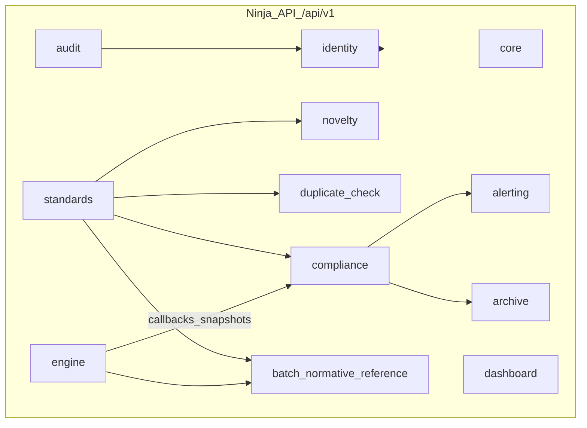

# 后端各模块：代码、路由与协作边界（多成员开发用）

本文档与 OpenAPI 分期一致，便于并行开发与 Code Review。工程入口见 [backend/config/api.py](../backend/config/api.py)。

## 全局约定（所有成员共用）

- **API 根路径**：[`backend/config/urls.py`](../backend/config/urls.py) 挂载 **`/api/v1/`**。
- **模块路由注册**：[`backend/config/api.py`](../backend/config/api.py) 使用 `add_router`。**合并时易产生冲突**，约定：只追加 import + 一行 `add_router`，保持本文件已有顺序或字母序。
- **单模块目录范式**
  - `apps/<module>/api/router.py`：对外 HTTP（Django Ninja `Router`）。
  - `schemas/`：Pydantic 入参/出参。
  - `services/`：领域逻辑、事务、ORM/外部调用；**避免在 router 写裸 SQL**。
  - `models.py`：Django ORM；与 [`v1.0-sql/`](../v1.0-sql/) 对齐时走 migrations 评审。
  - `tasks.py`：Celery（异步阶段再接 Redis/Worker，见 [backend/README.md](../backend/README.md)）。
- **鉴权**：Ninja 统一 Auth（JWT 或 Session）；超管 / 操作员差异在 `identity` 与各路由依赖中体现；**审计查询仅超管**在 `audit` 强制校验。
- **AI 编排边界**：重解析、工作流执行在 **`apps/engine`**（Webhook、任务状态）；业务域只保留「发起任务、保存快照、读结果」薄接口。

---

## `apps/core`（公共底座）

| 项 | 说明 |
|----|------|
| **职责** | 健康检查、全局异常与分页封装占位、与 `settings` 相关的工具；**不写业务表**。 |
| **路由前缀** | `add_router("", core_router)` → **`/api/v1/health`** 等。 |
| **建议补充代码** | `GET /version`；`services/` 中 `Pagination` / 统一错误体。 |
| **协作** | 全员可用；改动需克制。 |

---

## `apps/identity`（用户与 RBAC，需求 8.7 一部分）

| 项 | 说明 |
|----|------|
| **职责** | 登录/登出/刷新（JWT 待定）、用户 CRUD（超管）、角色（超管 / 操作兼审核员）、权限；与前端共同保证审计入口对操作员不可见。 |
| **路由前缀** | **`/api/v1/identity`** |
| **建议路由组** | `POST /auth/login`、`POST /auth/logout`、`POST /auth/refresh`；`GET/POST /users`、`GET/PATCH/DELETE /users/{id}`；`GET/PUT /roles/{id}/permissions`。 |
| **models / services** | `AbstractUser` 或 `UserProfile`；`services/auth.py` 签发 token；`schemas/` 勿返回密码哈希。 |
| **依赖** | 被 `audit`、各业务路由依赖引用。 |

---

## `apps/standards`（标准库管理，需求 8.1）

| 项 | 说明 |
|----|------|
| **职责** | ICS/CCS/自定义分类；国标元数据；正文目录与拆解；谱系；检索与统计。 |
| **路由前缀** | **`/api/v1/standards`** |
| **已实现（2026-05）** | `GET /resolve-latest`、`POST /resolve-latest/batch`、`GET /national-standard-names`（见 [standards 只读 API](./backend-standards-只读API说明.md)）；核心逻辑在 `services/reference_resolution.py`、`reference_bundle.py`。 |
| **与 DDL** | [`v1.0-sql/`](../v1.0-sql/) 中 `ics`、`ccs`、`national_standard_*`、`standard_document_catalog`、`standard_pedigree` 等——**表结构变更需评审**（见文末「DDL/ORM 对齐职责」）。 |
| **建议路由组（后续）** | `/ics`、`/ccs`、`/custom-tags`；`/national-standards`；`/national-standards/{id}/catalog`、`/chunks`；`/stats/overview`。 |
| **services** | 谱系递归/CTE；关键词检索；批量导入流水线。 |
| **tasks（后续）** | 大批量导入、索引重建。 |
| **被依赖** | `novelty`、`duplicate_check`、`compliance`、`batch_normative_reference`、`alerting`、`dashboard`。 |

---

## `apps/novelty`（查新，需求 8.2）

| 项 | 说明 |
|----|------|
| **职责** | 任务创建（PDF 或标准号）；引用清单/专用表初稿（协同 `engine`）；溯源；查新报告 PDF 元数据与下载。 |
| **路由前缀** | **`/api/v1/novelty`** |
| **建议路由组** | `POST /tasks`；`GET /tasks`、`GET /tasks/{id}`；`POST /tasks/{id}/submit-files`；`GET .../references`、`.../trace`、`.../report`。 |
| **services** | 编排 `standards` + `engine`；状态机：draft → parsing → reviewed_refs → traced → reported。 |
| **tasks** | 解析、报告渲染（后期 Celery）。 |
| **依赖** | `standards`、`engine`、`archive`。 |

---

## `apps/duplicate_check`（查重，需求 8.3）

| 项 | 说明 |
|----|------|
| **职责** | 名称/关键词/大纲 + 阈值；现行国标检索；重合度、覆盖建议、查重报告。 |
| **路由前缀** | **`/api/v1/duplicate-check`** |
| **建议路由组** | `POST /jobs`；`GET /jobs/{id}`、`.../matches`、`.../report`。 |
| **services** | 相似度算法；阈值过滤；可选检索日志供仪表盘热词。 |
| **tasks** | 大批量比对、报告生成。 |
| **依赖** | `standards`、`archive`。 |

---

## `apps/batch_normative_reference`（批量规范性引用，独立能力）

**不在**需求 8.x 原文章节编号内，为平台扩展能力；与合规向导 **API 解耦**。

| 项 | 说明 |
|----|------|
| **职责** | 单次最多 100 个 PDF 批量上传；Dify 解析；引用查新；文件级合规/不合规/不确定结论；批次与条目管理。 |
| **路由前缀** | **`/api/v1/batch-normative-reference`** |
| **DDL** | 仅 Django migration（`batch_normative_reference_job` / `item`），无 v1.0-sql 分片。 |
| **文档** | [API 前端对接手册](./backend-batch-normative-reference-API-前端对接手册.md) |
| **依赖** | `standards`（查新）、`engine`（独立 `BATCH_NORMATIVE_REF_*` 环境变量）。 |

---

## `apps/compliance`（合规性评价，需求 8.4）

**实施口径（必读）**：[《合规性评价：流程与接口约定》](./backend-compliance-流程与接口约定.md) — 前端 **6 步向导**、人工 **5 次审核**、**3 次 Dify**、引用侧 **n→n+m** 补充、多份证书与步骤 6 汇总下载；**分阶段实现与 F1～F12 完整性清单**见 [《合规性评价：分阶段实现方案》](./backend-compliance-分阶段实现方案.md)。本表为模块级摘要。

| 项 | 说明 |
|----|------|
| **职责** | 评价任务/会话 **状态机**（6 步 + 5 审闸门）；企标上传；解析与指标/引用 **JSON 契约**落库；调用 `engine` 触发 Dify **①**、**按需 ②**（见 [流程约定](./backend-compliance-流程与接口约定.md)：`national_standard_indicator` 先查；**需 Dify② 前**校验 `national_standard_basic.std_file_path`，缺失则 **`missing_gb_files`** 提示用户上传国标并回填路径）、**③**；读 `standards` 解析「引用号 → 最新标准号」；各阶段 **证书/报告路径**（描述性证书首期留白）；步骤 6 **全流程汇总与下载**；**状态快照**（断点恢复）；Diff 钩子供 `audit`。 |
| **路由前缀** | **`/api/v1/compliance`** |
| **与 DDL** | 如 [`standards_db_v1.0_enterprise_standard_basic`](../v1.0-sql/standards_db_v1.0_enterprise_standard_basic.sql)、[`enterprise_standard_reference_mapping`](../v1.0-sql/standards_db_v1.0_enterprise_standard_reference_mapping.sql)、[`evaluation_result`](../v1.0-sql/standards_db_v1.0_evaluation_result.sql) 等；任务级扩展表须评审，见 [《DDL/ORM 对齐职责》](./backend-DDL-ORM-对齐职责.md)。 |
| **建议路由组** | `/rules`；`POST/GET /evaluations`、`.../upload`；`.../step/{1..6}` 或 `.../step/1/confirm`…；`.../reference-latest`、`.../supplements`；`.../national-standards/upload`（或等价，国标 `std_file_path` 补缺）；`.../dify-runs`；`.../summary`、`.../artifacts`（证书/报告下载）；不合规报告路径可与 `evaluation_result` 或 `archive` artifact 对齐。 |
| **services** | 状态机与审核闸门；`standards` 只读查询（最新版号）；经 `engine` 编排 Dify；Diff（供 `audit`）。 |
| **tasks** | Dify 轮询/回调后的异步落档（后期 Celery）。 |
| **依赖** | `standards`、`engine`、`archive`、`alerting`、`audit`。 |

---

## `apps/alerting`（预警，需求 8.5）

| 项 | 说明 |
|----|------|
| **职责** | 一企一库；合规归档同步专用表；基准库变更触发；预警通知单。 |
| **路由前缀** | **`/api/v1/alerting`** |
| **建议路由组** | `GET/PATCH /enterprises/{id}/library`；`/alerts`、`/watch-rules` 等。 |
| **services** | 对接 `compliance` 归档钩子；重算队列。 |
| **tasks** | 定期扫描、事件重算（后期 Celery）。 |
| **依赖** | `compliance`、`standards`。 |

---

## `apps/archive`（模板与存档，需求 8.6）

| 项 | 说明 |
|----|------|
| **职责** | 模板版本；历史记录检索；下载中心（预览、单笔、批量打包）。 |
| **路由前缀** | **`/api/v1/archive`** |
| **建议路由组** | `/templates`；`/artifacts`；`/packages`。 |
| **services** | 存储抽象；路径混淆（保密）；zip 打包。 |
| **tasks** | 批量打包（后期 Celery）。 |
| **依赖** | 被 `novelty`、`duplicate_check`、`compliance` 引用产物。 |

---

## `apps/audit`（审计，需求 8.7）

| 项 | 说明 |
|----|------|
| **职责** | 登录与关键操作审计；字段级 Diff；查询/导出**仅超管**；日志追加、不可篡改。 |
| **路由前缀** | **`/api/v1/audit`** |
| **建议路由组** | `/logs`、`/export`；Diff 详情接口。 |
| **services** | `AuditService.append()`； hooks；禁止 update/delete 审计行。 |
| **依赖** | `identity`。 |

---

## `apps/dashboard`（仪表盘，需求 8.8）

| 项 | 说明 |
|----|------|
| **职责** | 只读聚合：待办、任务量、合规趋势、标准库监控、风险、效能、热词、异常操作等。 |
| **路由前缀** | **`/api/v1/dashboard`** |
| **建议路由组** | `/summary`、`/todo-counts`、`/service-stats`、`/standard-library-stats`、`/risk-map`、`/efficiency`、`/audit-snapshot`。 |
| **services** | 聚合查询；后期可缓存。 |
| **依赖** | 读 `compliance`、`alerting`、`standards`、`audit`、`duplicate_check`、`novelty`。 |

---

## `apps/engine`（AI/工作流适配）

| 项 | 说明 |
|----|------|
| **职责** | Dify Webhook、run id、回调更新状态、契约 JSON；LangGraph 预留。 |
| **路由前缀** | **`/api/v1/engine`** |
| **建议路由组** | `/workflows/run`、`/callbacks/dify/{task_type}`、`/runs/{external_id}`。 |
| **services** | HTTP 客户端、重试、幂等。 |
| **依赖** | 被 `novelty`、`compliance` 调用；**不写完整业务状态机**。 |

---

## DDL / ORM 对齐职责（专人 + 评审）

- **范围**：[`v1.0-sql/`](../v1.0-sql/) 与 Django `models` / `migrations` 字段、索引、外键一致；重大变更需书面或 PR 说明。
- **建议**：指定一名 **数据负责人**（或架构接口人）维护「DDL ↔ ORM 对照表」，合并涉及表结构的 PR 必须经其或代理人 Review。
- **分期**：可先只读 API + 手动对齐现有库，再逐步把 ORM 覆盖全部表。
- **流程与角色细化**：见 [《DDL/ORM 对齐职责》](./backend-DDL-ORM-对齐职责.md)。

---

## 分期建议（降低并行耦合）

**实际进度（2026-05，与上表并行开发结果一致）**：

| 原分期 | 状态 |
|--------|------|
| 第一期 `identity`+`audit`+`standards` 只读 | **部分**：`standards` 查新只读 API 已上线；`identity`/`audit` 仍为骨架 → [分期启动说明](./backend-identity-audit-分期启动说明.md) |
| 第二期 `compliance`+`archive` | **compliance substantial**（Dify **① 已真连**，②③ 代码就绪）；`archive` 骨架 |
| — | **额外完成**：`batch_normative_reference` 独立模块 |
| 第三期 `novelty`+`duplicate_check`+`engine` | **未启动**（engine ①②③ HTTP 已有，Webhook 未实现） |
| 第四期 `alerting`+`dashboard` | **未启动** |

原分期路线图（供新成员理解依赖顺序）：

1. **第一期**：`identity` + `audit` 底座；`standards` 元数据与谱系只读；`core`。  
2. **第二期**：`compliance` 任务流；`archive`。  
3. **第三期**：`novelty`、`duplicate_check`；`engine` Webhook 与异步契约收尾。  
4. **第四期**：`alerting`、`dashboard` 全量指标。
