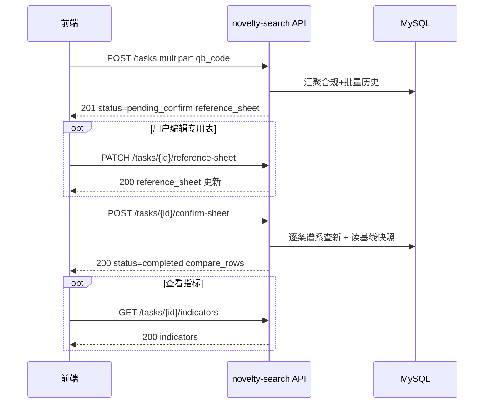

# 查新服务模块 API — 前端对接说明（当前后端实现）

> 文档版本：2026-05-28  
> 对应代码：`backend/apps/novelty/`  
> 路由注册：`backend/config/api.py` → `/api/v1/novelty-search`  
> 联调脚本：`backend/scripts/test_novelty_search.py`

本文档根据**当前已上线的后端实现**编写，供前端对接。若与早期需求稿 [`backend-novelty-search-API-后端对接手册.md`](backend-novelty-search-API-后端对接手册.md) 有差异，**以本文档为准**。

---

## 1. 模块做什么

查新服务以 **企标号 `qb_code`** 为入口，完成三件事：

1. **汇聚历史**：从本系统已有的 **合规评价**（Step3 已完成）和 **批量规范性引用**（子项 `completed`）中，取出该企标曾出现过的规范性引用与指标。
2. **专用表确认**：生成可编辑的「查新专用表」（引用标准号、标准名称等），用户确认后再比对。
3. **三列查新比对**：对每条引用展示三列，并给出结论：
   - **列 1**：企标中引用的、补全年代号后的标准号（`full_std_at_publication`）
   - **列 2**：第一次查新时记录的基线现行号（`baseline_latest_std_primary`，只读快照）
   - **列 3**：本次实时谱系查新的现行号（`current_latest_std_primary`）

**前端不需要**直接调用合规模块的 `evaluation_task_id` 或 `GET .../step/3/reference-latest`；查新流程只走本模块 API。

### 1.1 与其它模块的关系

| 模块 | 路径 | 查新模块如何使用 |
|------|------|------------------|
| 合规评价 | `/api/v1/compliance` | **只读**历史任务、映射表、指标；Step3 确认时会**写入基线快照** |
| 批量规范性引用 | `/api/v1/batch-normative-reference` | **只读**已完成子项的 `references_resolved`；子项完成/PATCH 时会**写入基线快照** |
| 标准库谱系 | `/api/v1/standards` | 后端内部复用谱系解析，前端**无需**单独调 `resolve-latest` |
| 查新服务 | `/api/v1/novelty-search` | 前端主入口 |

---

## 2. 环境与依赖

### 2.1 Base URL

```text
http://{host}:{port}/api/v1/novelty-search
```

本地默认：`http://127.0.0.1:8000/api/v1/novelty-search`

Swagger / OpenAPI：启动 `runserver` 后访问 `/api/docs`（Ninja 文档）。

### 2.2 数据库要求

- 后端环境变量 **`COMPLIANCE_REQUIRE_MYSQL=true`** 时，创建任务、确认比对等接口会调用 `require_mysql()`，**必须使用 MySQL** 且已导入 `standard_pedigree`、`national_standard_basic`、`enterprise_standard_reference_mapping` 等表。
- 未配置 MySQL 时相关接口返回 **503**，`detail` 为中文说明。

### 2.3 鉴权

与合规模块相同，由 **`COMPLIANCE_API_AUTH_REQUIRED`** 控制（`backend/.env`）：

| 配置 | 行为 |
|------|------|
| `false`（默认） | 除 `GET /module` 外可不传 `Authorization` |
| `true` | 需 `Authorization: Bearer <token>`；任务列表/详情仅返回 `created_by` 与当前 token 对应 subject 一致的任务，否则 **403** |

```http
Authorization: Bearer <your-token>
```

开发期 `BearerAuthPlaceholder` 会将 token 截断后作为 `created_by` 存储，便于多用户隔离测试。

### 2.4 通用错误格式

```json
{ "detail": "错误说明（中文）" }
```

| HTTP | 含义 |
|------|------|
| 400 | 参数缺失（如未传 `qb_code`） |
| 403 | 无权访问他人任务 |
| 404 | 任务不存在 / 无指标数据 |
| 422 | 业务校验失败（无历史、状态不允许、专用表已确认等） |
| 501 | 功能未实现（PDF 报告） |
| 503 | 非 MySQL 或谱系依赖未就绪 |

`detail` 中常含可解析关键字，建议前端做映射：

| 关键字（出现在 detail 中） | 含义 |
|---------------------------|------|
| `empty_history` | 该企标在系统中无合规 Step3+ / 批量 completed 记录 |
| `invalid_status` | 当前任务状态不允许该操作 |
| `sheet_not_confirmed` / `专用表已确认` | 专用表已锁定 |

---

## 3. 推荐前端流程（当前实现为同步）

当前后端 **未使用 Celery**，创建任务与确认比对在**单次请求内完成**，一般**不需要**对 `loading_history` / `comparing` 做轮询（除非后续版本改为异步）。



### 3.1 步骤说明

| 步骤 | 接口 | 说明 |
|------|------|------|
| 1 | `POST /tasks` | 必填 `qb_code`；成功则直接进入 `pending_confirm`，响应含 `reference_sheet` 初稿 |
| 2（可选） | `PATCH .../reference-sheet` | 用户改 `std_no`、名称、备注等 |
| 3 | `POST .../confirm-sheet` | 触发三列比对；**同一次响应**即 `status=completed` 且带 `compare_rows` |
| 4（可选） | `GET .../indicators` | 指标较多时可走子接口，主详情里 `indicators_available=true` |

失败任务：`POST .../retry`（仅 `status=failed`）。

---

## 4. 核心概念

### 4.1 任务状态 `status`

| 值 | 含义 | 前端建议 |
|----|------|----------|
| `queued` | 已创建排队 | 当前实现中几乎不出现（创建后很快进入下一状态） |
| `loading_history` | 汇聚历史中 | 创建过程中短暂状态；**同步实现下响应已是 `pending_confirm`** |
| `parsing` | 解析上传 PDF | **未实现**；上传文件仅保存，不进入此状态 |
| `pending_confirm` | 待确认专用表 | 展示 `reference_sheet`，允许 PATCH |
| `comparing` | 比对中 | 确认瞬间可能出现；**同步实现下响应已是 `completed`** |
| `completed` | 比对完成 | 展示 `compare_rows`、`task_conclusion` |
| `failed` | 失败 | 展示 `error_summary`，可 retry |

### 4.2 三列比对字段（主表）

| UI 列名（建议） | 响应字段 | 说明 |
|-----------------|----------|------|
| 企标引用号（可选） | `referenced_std_code` | 与专用表 `std_no` 对应 |
| 列 1：发布时点补全号 | `full_std_at_publication` | 与合规 `reference-latest` 的 `full_std_at_publication` 一致 |
| 列 2：首次查新基线 | `baseline_latest_std_primary` | 来自表 `novelty_reference_baseline_snapshot`；无基线时为 `null` |
| 列 3：本次查新现行 | `current_latest_std_primary` | 本次 `confirm-sheet` 时实时谱系查询 |
| 结论 | `row_conclusion` + `row_conclusion_label` | 见下表 |
| 谱系说明 | `explanation` | 谱系链文字，可 tooltip 展示 |
| 是否可自动比对 | `compliance_assessable` | `false` 时行结论多为 `not_assessable` |

### 4.3 行级结论 `row_conclusion`

| 值 | `row_conclusion_label` | 判定条件（实现） |
|----|------------------------|------------------|
| `unchanged` | 无变化 | 基线、本次现行均非空且规范化后相等 |
| `updated` | 标准已更新 | 均非空且不相等 |
| `first_record` | 首次建立基线 | 基线为空、本次现行非空 |
| `unresolved` | 无法解析现行号 | 本次现行为空 |
| `not_assessable` | 不可自动比对 | `compliance_assessable === false` |

规范化规则与合规一致：去首尾空格、全角连字符归一为 `-`、连续空白压缩（`normalize_std_code_for_citation_match`）。

### 4.4 任务级结论 `task_conclusion`

| 值 | 含义 |
|----|------|
| `has_updates` | 至少一行 `row_conclusion === updated` |
| `all_unchanged` | 无可比对行被判定为 `updated`，且无 `unresolved`/`not_assessable`（**含全部为 `first_record` 时也可能落在此项**） |
| `partial` | 存在无法完整比对的行，同时仍有可比对行 |
| `pending` | 无比对行 |
| `empty_history` | 创建失败语义（任务可能未创建成功） |

人类可读摘要见 **`task_summary`**，例如：`共 2 条引用，全部无变化`。

### 4.5 基线快照（列 2 的数据来源）

- 表名：`novelty_reference_baseline_snapshot`
- 写入时机（**仅首次**，不覆盖）：
  - 合规 **`POST .../step/3/confirm`** 成功后
  - 批量子项 **`status=completed`** 写入 `reference_resolution_json` 后
  - 批量 **`PATCH .../references_resolved`** 人工修订后
- 查新模块 **只读** 基线；不在查新 API 内定义「第一次」

因此：**首次查新**时列 2 常为空，行结论多为 `first_record`；同一企标在完成合规/批量并写入基线后，**再次查新**才会出现列 2 与 `unchanged`/`updated` 对比。

### 4.6 历史汇聚规则（`POST /tasks` 时）

对 `qb_code` 规范化匹配（忽略大小写、连字符统一）：

| 数据源 | 条件 |
|--------|------|
| 合规 | `compliance_evaluation_task.qb_code` 匹配且 `current_step >= 4` |
| 批量 | `batch_normative_reference_item.status = completed` 且 `parse_result_json` 中企标号匹配 |

引用按 **`referenced_std_code`（规范化）去重**：

- `full_std_at_publication`：取**最近一条**历史记录中的非空值
- 专用表 `std_name`：合并时尽量保留；可来自国标库名称
- **不会**用「最近一次评价」覆盖基线快照

无任一历史来源时，`POST /tasks` 返回 **422**，`detail` 含 `empty_history` 语义。

---

## 5. 接口一览

| 方法 | 路径 | 作用 |
|------|------|------|
| GET | `/module` | 模块元信息（可匿名） |
| POST | `/tasks` | 创建任务，汇聚历史，生成专用表初稿 |
| GET | `/tasks` | 分页列表 |
| GET | `/tasks/{task_id}` | 任务详情 |
| DELETE | `/tasks/{task_id}` | 删除单条查新任务（历史查询记录） |
| PATCH | `/tasks/{task_id}/reference-sheet` | 保存专用表草稿 |
| POST | `/tasks/{task_id}/confirm-sheet` | 确认专用表并执行三列比对 |
| POST | `/tasks/{task_id}/retry` | 失败任务重试 |
| GET | `/tasks/{task_id}/indicators` | 指标明细（可选） |
| POST | `/tasks/{task_id}/report` | **未实现**，固定 **501** |

---

## 6. 接口详情

### 6.1 `GET /module`

**鉴权**：无。

**响应 200**：

```json
{
  "module": "novelty_search",
  "requirement_section": "8.2",
  "scope": "按企标号汇聚历史合规/批量引用，三列比对查新"
}
```

---

### 6.2 `POST /tasks` — 创建查新任务

**作用**：校验企标号 → 汇聚历史引用与指标 → 生成专用表初稿 → 状态 **`pending_confirm`**。

**Content-Type**：`multipart/form-data`（与合规上传类似，**不要用** `application/json` 传 `qb_code`）。

| 字段 | 类型 | 必填 | 说明 |
|------|------|------|------|
| `qb_code` | string | 是 | 企标号，如 `Q/MPSTC 0010-2018` |
| `source` | string | 否 | `upload`（默认）、`form`、`national`；仅落库，**不改变**汇聚逻辑 |
| `file` | file | 否 | 企标 PDF/DOCX；**仅保存到媒体目录**，不触发 Dify 解析 |

**未实现字段**（需求稿中的 `form_std_nos`、`national_std_nos` 当前路由**未接收**，请勿依赖）。

**响应 201**：`NoveltyTaskOut`（见 §8）。

**错误**：

- **422**：无历史，`detail` 示例：  
  `该企标号在系统中无合规评价或批量规范性引用记录，无法汇聚引用（empty_history）`
- **503**：MySQL 未配置或 `COMPLIANCE_REQUIRE_MYSQL=true` 但当前库非 MySQL

**curl 示例**：

```bash
curl -X POST "http://127.0.0.1:8000/api/v1/novelty-search/tasks" \
  -H "Authorization: Bearer dev-token" \
  -F "qb_code=Q/MPSTC 0010-2018" \
  -F "source=upload"
```

**前端 TypeScript 示例**：

```typescript
const form = new FormData()
form.append('qb_code', 'Q/MPSTC 0010-2018')
form.append('source', 'upload')
// if (file) form.append('file', file)

const { data } = await axios.post('/api/v1/novelty-search/tasks', form, {
  headers: { 'Content-Type': 'multipart/form-data' },
})
// data.status === 'pending_confirm'
// data.reference_sheet — 专用表初稿
```

---

### 6.3 `GET /tasks` — 任务列表

**Query**：

| 参数 | 类型 | 默认 | 说明 |
|------|------|------|------|
| `page` | int | 1 | 页码 |
| `page_size` | int | 20 | 每页条数，最大 100 |
| `qb_code` | string | — | 模糊匹配企标号（`icontains`） |
| `status` | string | — | 精确匹配任务状态 |
| `keyword` | string | — | 标题或企标号模糊搜索 |

**响应 200**：

```json
{
  "results": [ { "...NoveltyTaskSummaryOut" } ],
  "total": 42,
  "page": 1,
  "page_size": 20
}
```

列表项为摘要字段（**不含** `reference_sheet` / `compare_rows`），见 §8.2。

---

### 6.4 `GET /tasks/{task_id}` — 任务详情

**作用**：获取完整任务，含专用表、比对结果、历史来源列表。

**响应 200**：`NoveltyTaskOut`。

**说明**：

- `indicators_available === true` 时表示存在 `indicators_json`，可调 `GET .../indicators` 减轻主包体体积。
- 当前实现**不会**把 `indicators` 内嵌在详情里，仅布尔标记。

---

### 6.5 `DELETE /tasks/{task_id}` — 删除查新任务

**作用**：从「查新任务列表」中删除一条**历史查询记录**（`novelty_search_task` 表行）。

**不会删除**：

- 合规/批量评价原始数据；
- **基线快照** `novelty_reference_baseline_snapshot`（按企标号+引用号共享，供后续查新列 2 使用）。

**会删除**：

- 该任务的专用表、比对结果、指标 JSON 等任务内数据；
- 若创建时上传过文件，会尽量删除 `media/novelty_search/{task_id}/` 目录。

**前置条件**：无状态限制（`pending_confirm` / `completed` / `failed` 均可删）。

**鉴权**：与详情一致；开启鉴权时仅能删除 `created_by` 属于自己的任务。

**响应**：**204 No Content**（无 body）。

**错误**：

| HTTP | 场景 |
|------|------|
| 404 | 任务不存在 |
| 403 | 无权删除他人任务 |

**curl**：

```bash
curl -X DELETE "http://127.0.0.1:8000/api/v1/novelty-search/tasks/2" \
  -H "Authorization: Bearer dev-token"
```

**前端建议**：列表页操作列「删除」→ 确认弹窗 → 成功后从列表移除或刷新 `GET /tasks`。

---

### 6.6 `PATCH /tasks/{task_id}/reference-sheet` — 保存专用表草稿

**前置条件**：

- `status === pending_confirm`
- `sheet_confirmed === false`

**Content-Type**：`application/json`

**请求体**：

```json
{
  "rows": [
    {
      "id": "1",
      "std_no": "GB/T 1184-1996",
      "std_name": "形状和位置公差 未注公差值",
      "tech_fragment": null,
      "remark": ""
    }
  ]
}
```

| 字段 | 说明 |
|------|------|
| `id` | 行 ID，字符串；不传则按序号生成 |
| `std_no` | **比对时作为引用标准号**（等同 `referenced_std_code`） |
| `std_name` | 展示用标准名称 |
| `tech_fragment` | 技术条文片段，可选 |
| `remark` | 备注 |

**响应 200**：`NoveltyTaskOut`（`reference_sheet` 已更新，`compare_total` 同步为行数）。

**错误 422**：状态不对或专用表已确认。

---

### 6.7 `POST /tasks/{task_id}/confirm-sheet` — 确认并比对

**作用**：

1. 锁定专用表（`sheet_confirmed = true`）
2. 对每行 `std_no` 调用谱系服务（企标时点年份从 `qb_code` 末段年份推断，如 `2018`）
3. 读取基线快照填列 2，实时查新填列 3，计算行级/任务级结论
4. 状态置为 **`completed`**（同步完成）

**Content-Type**：`application/json`

**请求体（可选）**：

```json
{
  "rows": [ { "id": "1", "std_no": "GB/T 1184-1996", "std_name": "...", "tech_fragment": null, "remark": "" } ]
}
```

- 若传 `rows`：先按 PATCH 规则保存，再比对。
- 若省略 body 或 `rows` 为 `null`：使用已保存的专用表。

**响应 200**：`NoveltyTaskOut`，重点字段：

- `status`: `"completed"`
- `compare_rows`: 三列比对数组
- `task_conclusion` / `task_summary`
- `compare_done` === `compare_total` === 行数

**错误 422**：专用表为空、状态不是 `pending_confirm`、已确认过等。

---

### 6.8 `POST /tasks/{task_id}/retry` — 重试

**前置条件**：`status === failed`

**作用**：重新汇聚历史，重置为 `pending_confirm`，清空比对结果与结论。

**响应 200**：`NoveltyTaskOut`

**错误 422**：非 failed 状态，或仍无历史数据。

---

### 6.9 `GET /tasks/{task_id}/indicators` — 指标明细

**作用**：返回创建任务时汇聚的指标，结构与合规 Step4 相近，便于复用指标展示组件。

**响应 200**：

```json
{
  "enterprise_indicators": [
    { "name": "铅", "value": "0.1", "source": "batch", "source_id": 2268 }
  ],
  "national_by_std_code": {
    "GB/T 1.1-2020": [ { "indicator_name": "…", "indicator_type": "…", "content": "…" } ]
  },
  "source_evaluations": [
    {
      "source_type": "batch",
      "source_id": 2268,
      "evaluated_at": "2026-05-27T05:35:27.825442+00:00",
      "title": "批量规范性引用子项 #2268"
    }
  ]
}
```

**错误 404**：`indicators_json` 为空。

---

### 6.10 `POST /tasks/{task_id}/report` — PDF 报告

**当前实现**：固定返回 **501**，`detail`: `查新 PDF 报告生成功能尚未实现`。

**前置校验**：若任务非 `completed`，先返回 **422**。

前端请**不要**依赖此接口；按钮可隐藏或置灰。

---

## 7. 响应模型说明

### 7.1 `NoveltyTaskOut`（任务详情 / 创建 / 确认）

| 字段 | 类型 | 说明 |
|------|------|------|
| `id` | int | 任务 ID |
| `title` | string | 默认 `{qb_code} {YYYY-MM-DD}` |
| `qb_code` | string | 企标号 |
| `enterprise_name` | string \| null | **当前固定为 null**（预留） |
| `status` | string | 见 §4.1 |
| `source` | string | `upload` \| `form` \| `national` |
| `file_name` | string \| null | 上传原始文件名 |
| `sheet_confirmed` | bool | 专用表是否已确认 |
| `task_conclusion` | string \| null | 任务级结论 |
| `task_summary` | string \| null | 中文摘要 |
| `error_summary` | string \| null | 失败原因 |
| `compare_done` | int | 已完成比对条数 |
| `compare_total` | int | 总条数 |
| `report_state` | string | `none` \| `generating` \| `ready` \| `failed`（报告未实现时多为 `none`） |
| `report_generated_at` | string \| null | ISO8601 |
| `reference_sheet` | `ReferenceSheetRowOut[]` | 专用表 |
| `compare_rows` | `NoveltyCompareRowOut[]` | 比对结果（确认后才有） |
| `source_evaluations` | `SourceEvaluationOut[]` | 历史评价来源 |
| `indicators_available` | bool | 是否可请求 indicators 子接口 |
| `created_at` | string | ISO8601 |
| `updated_at` | string | ISO8601 |

### 7.2 `ReferenceSheetRowOut`

| 字段 | 类型 |
|------|------|
| `id` | string |
| `std_no` | string |
| `std_name` | string |
| `tech_fragment` | string \| null |
| `remark` | string \| null |

### 7.3 `NoveltyCompareRowOut`

| 字段 | 类型 | 说明 |
|------|------|------|
| `id` | string | 比对行 ID |
| `sheet_row_id` | string | 对应专用表行 `id` |
| `referenced_std_code` | string | 引用标准号 |
| `full_std_at_publication` | string \| null | 列 1 |
| `baseline_latest_std_primary` | string \| null | 列 2 |
| `current_latest_std_primary` | string \| null | 列 3 |
| `row_conclusion` | string | 行结论枚举 |
| `row_conclusion_label` | string | 中文标签 |
| `compliance_assessable` | bool | |
| `explanation` | string \| null | 谱系链 |
| `baseline_source` | string \| null | `compliance` \| `batch` |
| `baseline_recorded_at` | string \| null | ISO8601 |

### 7.4 `NoveltyTaskSummaryOut`（列表项）

与 `NoveltyTaskOut` 相同字段子集：**不含** `reference_sheet`、`compare_rows`、`source_evaluations`、`error_summary`、`report_generated_at`。

---

## 8. 完整响应示例（确认比对后）

以下为企标 **`Q/MPSTC 0010-2018`** 实测节选（列 2 无基线为正常现象）：

```json
{
  "id": 2,
  "title": "Q/MPSTC 0010-2018 2026-05-28",
  "qb_code": "Q/MPSTC 0010-2018",
  "status": "completed",
  "sheet_confirmed": true,
  "task_conclusion": "all_unchanged",
  "task_summary": "共 2 条引用，全部无变化",
  "compare_done": 2,
  "compare_total": 2,
  "reference_sheet": [
    { "id": "1", "std_no": "GB/T 1184-1996", "std_name": "形状和位置公差 未注公差值", "tech_fragment": null, "remark": "" },
    { "id": "2", "std_no": "GB/T 1804-2000", "std_name": "一般公差 未注公差的线性和角度尺寸的公差", "tech_fragment": null, "remark": "" }
  ],
  "compare_rows": [
    {
      "id": "1",
      "sheet_row_id": "1",
      "referenced_std_code": "GB/T 1184-1996",
      "full_std_at_publication": "GB/T 1184-1996",
      "baseline_latest_std_primary": null,
      "current_latest_std_primary": "GB/T 1184-1996",
      "row_conclusion": "first_record",
      "row_conclusion_label": "首次建立基线",
      "compliance_assessable": true,
      "explanation": "{[-1]:{GB/T 1184-1996}}、{[1]:{GB 1184-1980}}",
      "baseline_source": null,
      "baseline_recorded_at": null
    },
    {
      "id": "2",
      "sheet_row_id": "2",
      "referenced_std_code": "GB/T 1804-2000",
      "full_std_at_publication": "GB/T 1804-2000",
      "baseline_latest_std_primary": null,
      "current_latest_std_primary": "GB/T 1804-2000",
      "row_conclusion": "first_record",
      "row_conclusion_label": "首次建立基线",
      "compliance_assessable": true,
      "explanation": "{[-1]:{GB/T 1804-2000}}、{[1,1]:{GB/T 1804-1992、GB/T 11335-1989}}",
      "baseline_source": null,
      "baseline_recorded_at": null
    }
  ],
  "source_evaluations": [
    { "source_type": "batch", "source_id": 2268, "evaluated_at": "2026-05-27T05:35:27.825442+00:00", "title": "批量规范性引用子项 #2268" },
    { "source_type": "batch", "source_id": 1237, "evaluated_at": "2026-05-15T04:58:56.307852+00:00", "title": "批量规范性引用子项 #1237" }
  ],
  "indicators_available": true
}
```

---

## 9. 前端页面建议映射

| 页面/区域 | 使用字段 / 接口 |
|-----------|-----------------|
| 查新入口 | 输入 `qb_code` → `POST /tasks` |
| 无历史提示 | 422 + `empty_history` 文案 |
| 专用表编辑 | `reference_sheet`；保存 → `PATCH .../reference-sheet` |
| 三列结果表 | `compare_rows` 三列 + `row_conclusion_label` |
| 任务总览 | `task_conclusion`、`task_summary` |
| 历史来源侧栏 | `source_evaluations`（可跳转批量/合规详情页，用 `source_type` + `source_id`） |
| 指标 Tab | `GET .../indicators` 或根据 `indicators_available` 显示 |
| 任务列表页 | `GET /tasks` + 筛选；删除 → `DELETE /tasks/{id}` |

---

## 10. 与需求稿差异（实现清单）

| 项目 | 需求稿 | 当前实现 |
|------|--------|----------|
| 路由前缀 | `/novelty-search` | ✅ 已实现 |
| 创建后异步轮询 | `loading_history` / `comparing` 轮询 1～3 秒 | ⚠️ **同步**，创建即 `pending_confirm`，确认即 `completed` |
| PDF 解析 `parsing` | 可选 | ❌ 未实现，仅存文件 |
| `form_std_nos` / `national_std_nos` | 扩展专用表 | ❌ 未接收 |
| `POST .../report` | PDF | ❌ **501** |
| `enterprise_name` | 可展示 | ⚠️ 恒为 `null` |
| 基线写入 | Step3 / 批量完成 | ✅ 已实现（查新只读） |

---

## 11. 后端联调与排查

```bash
cd backend
python manage.py migrate novelty
python scripts/test_novelty_search.py --qb-code "Q/MPSTC 0010-2018"
```

- 脚本默认 **direct 模式**（不依赖 runserver）。
- 结果 JSON：`backend/novelty_task_{id}_result.json`。

常见问题：

1. **422 empty_history**：该企标从未完成合规 Step3 或批量 completed，需先跑合规/批量评价。
2. **列 2 全空**：尚无基线快照；完成一次合规 Step3 确认或批量查新后会写入，**再次查新**才有列 2。
3. **503**：检查 `.env` 中 `MYSQL_*` 与 `COMPLIANCE_REQUIRE_MYSQL`。

---

## 12. 版本记录

| 日期 | 说明 |
|------|------|
| 2026-05-28 | 首版：对齐当前 `apps/novelty` 实现，含同步流程、未实现项与实测示例 |
| 2026-05-28 | 新增 `DELETE /tasks/{task_id}` 删除历史查新任务 |
