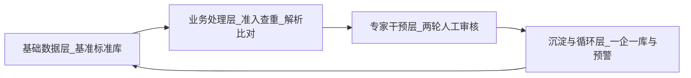

# 标准化信息服务平台 — 文档阅读结论

本文档汇总需求/技术栈阅读结论，并与 **2026-05 后端实现现状** 对齐。工程入口见 [backend/README.md](../backend/README.md)。

## 文档位置

- 需求分析：[标准化信息服务平台——需求分析文档.md](../标准化信息服务平台——需求分析文档.md)
- 技术栈说明：[标准化信息服务平台——技术栈详细说明文档.md](../标准化信息服务平台——技术栈详细说明文档.md)

---

## 1. 项目定位与目标

- **定位**：面向内部专家/管理员的工具平台，覆盖标准 **查新、查重、合规性评价、企标预警**，支撑标准生命周期管理与数字化转型。
- **目标摘要**：沉淀结构化标准库、用 AI + 自动化缩短合规评价周期、通过「一企一库」动态监控把被动合规变主动预警、仪表盘支撑决策。
- **设计原则**：稳定性优先、前后端深度协同（长耗时任务异步反馈）、**全程留痕（Diff、秒级审计）**、业务闭环（查新→查重→评价→预警）。

---

## 2. 角色与权限（RBAC）

| 角色 | 要点 |
|------|------|
| **超级管理员** | 全量权限；**唯一**可查看/检索/导出全流程审计日志 |
| **操作兼审核员** | 执行业务流与人工干预；**不可**看系统操作日志、不可导出审计、不可改底层安全配置 |

后端后续需落实 **RBAC** 与 **审计入口隔离**（文档要求操作员无法探测审计后台）。

---

## 3. 核心业务概念（贯穿各模块）

- **一企一库**：每家企业一条核心档案；合规评价归档后「企标专用表」同步进该档案，作为持续监控基础。
- **双集合指标比对**：合规评价不只比企标正文，而是 **「企标+引标指标集」vs「最新标指标集」**，输出高/低/一致及量化差值。
- **溯源**：有年代号直接走谱系；无年代号则结合企标发布年锁定当时有效版本再追溯到最新有效版本。

---

## 4. 业务流程四阶段（需求文档第七节）

---

## 5. 各模块要点与后端相关含义（流程级）

| 模块 | 后端侧关注点 |
|------|----------------|
| **8.1 标准库管理** | 行业分类（ICS/CCS/自定义）、国标元数据、正文库（目录+结构化拆解）、**谱系**（替代/废止链）、多维检索统计 |
| **8.2 查新** | 上传 PDF 或标准号 → 提取引用清单/专用表初稿 → 谱系溯源 → 现行/废止/将实施 → **查新报告 PDF** |
| **8.3 查重** | 对现行国标库按名称/关键词/大纲相似度检索 → 阈值可配 → **查重报告**（立项建议） |
| **8.4 合规性评价** | **工程实施口径**见 [《合规性评价：流程与接口约定》](./backend-compliance-流程与接口约定.md)：前端 **6 步**、人工 **5 审**、**Dify×3**（解析 / 拉齐指标 / 指标对比）；引用侧 **n→n+m** 补充；描述性证书首期留白；引用合规证书、指标对比证书、终局汇总与下载；落库与 `standards`/`engine`/`archive` 边界已写明。（需求原文 8.4 仍为业务基线。） |
| **8.5 预警** | 评价归档后写入一企一库；基准库变更事件触发重检 → 正向鼓励或负向预警通知 |
| **8.6 模板与存档** | 模板配置、历史检索、下载中心（预览/单笔/批量） |
| **8.7 安全与审计** | RBAC + 全流程审计（含专用表 Diff）；日志追加、不可删改 |
| **8.8 仪表盘** | 待办、任务量、合规率趋势、标准库资产与动态、预警与风险排行、效能与敏感操作等统计 |

---

## 6. 架构与技术栈（与后端直接相关）

需求文档 **第九节** 与技栈文档一致强调：

- **管理与业务大脑**：**Python 3.12 + Django Ninja** — RBAC、元数据、一企一库、审计。
- **AI/工作流执行引擎（1.0）**：**Dify** — PDF 解析、谱系溯源、指标比对等重逻辑；**2.0** 可能迁 **LangGraph**（取决于 Dify 对强逻辑与人工在环的适配度）。
- **数据层**：**MySQL 8.x**（当前落地；JSON 类型、递归 CTE 等用于谱系与指标；连接使用 PyMySQL）；**Celery + Redis**（异步任务与缓存/中间状态）。
- **文档解析**：**Marker**（结构化转 Markdown）、**PyMuPDF**（预览坐标/定位）。
- **前端**（供后端契约对齐）：React 18 + Ant Design 5 + ProComponents；状态 **Zustand**。

**解耦策略**：「专用表 JSON」等 **数据结构契约化**，便于 Dify ↔ LangGraph 切换时前端少改 UI。

**状态与留痕**：人工干预步骤需在 **MySQL** 中持久化状态快照（断点恢复）；核心 Service 挂 **审计 Hooks**。

---

## 7. 非功能性需求（后端设计约束摘要）

- **性能**：如 50 页内 PDF 到专用表初稿平均约 **20s 内**（100 页约 **60s**）；**>5s** 任务异步 + 进度；标准库规模上来后检索、谱系递归有时延指标。
- **稳定性**：断点续跑与秒级恢复；跨表操作用**事务**。
- **审计**：专用表等改动必须 **before/after Diff**；审计库只追加、不可篡改。
- **安全**：未过一审的数据标记 **待核实**；企标等敏感存储与 **AES-256** 等加密要求。

---

## 8. 当前阶段约定（与代码对齐，2026-05）

- **已完成（基建）**：Conda 环境 `sip-backend`、Django Ninja 多 App 骨架、MySQL 库 `standards_db_v1.0`、`v1.0-sql` / `merged_all.sql` 导入说明。
- **已完成（业务 substantial）**：
  - **8.4 合规性评价**：六步向导 API、步骤 1～3 全链（含真实 `reference-latest`）、步骤 4～5 代码与单测就绪；Dify **①** 已真连，**②③** 客户端已实现（见 [步骤 4～5 联调验证](./backend-compliance-步骤45-联调验证.md)）。
  - **批量规范性引用**：独立模块 `/api/v1/batch-normative-reference`（与合规 API 解耦）。
- **部分完成**：
  - **8.1 标准库**：服务层谱系/查新在 `apps/standards/services`；HTTP 已暴露只读查新 API（见 [standards 只读 API](./backend-standards-只读API说明.md)）。
  - **engine**：Dify ①②③ HTTP；Webhook 仍为占位。
- **未启动 / 骨架**：8.2 查新、8.3 查重、8.5 预警、8.6 archive 统一、8.7 真实 RBAC+审计、8.8 仪表盘。
- **分工与分期**：见 [《模块开发分工清单》](./backend-模块开发分工清单.md)；第一期 `identity`+`audit` 见 [分期启动说明](./backend-identity-audit-分期启动说明.md)。
