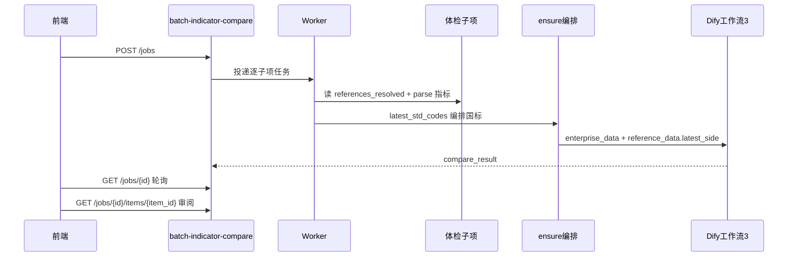

# 批量指标对比 API — 前端对接说明

> **模块路径**：`/api/v1/batch-indicator-compare`  
> **前端实现**：`frontend/src/services/batch-indicator-compare.ts`  
> **更新日期**：2026-05-23

---

## 1. 模块定位

| 模块 | 路径 | 与本模块关系 |
|------|------|----------------|
| **规范性体检** | `/api/v1/batch-normative-reference` | **数据源**：已完成子项的 `references_resolved`、解析企标指标 |
| **批量指标对比** | `/api/v1/batch-indicator-compare` | **本模块**：零人工批量跑技术指标对比、留痕、审阅、导出 |
| **合规性评价** | `/api/v1/compliance` | **逻辑复用**：ensure 编排国标指标 + Dify③ 对比；不创建 `evaluation_task` |
| **查新服务** | `/api/v1/novelty-search` | **本期无耦合**（前端不展示查新汇聚） |

**业务语义**：对已体检完成的企标，将 **工作流①提取的企标技术指标** 与 **最新 N 个国标指标** 做 Dify③ 对比。

**明确不含**：

- 发布时点旧国标指标块（`publication_side` 不再送入工作流③）
- 批量阶段的 **M 补充标准**（人工 PATCH 补录后可重跑）
- 查新三列 / 谱系基线对比

---

## 2. 业务流程



1. 前端从 **体检批次列表**（整批）或 **批次详情**（勾选子项）调用 `POST /jobs`。
2. 后端为每个源子项创建 **指标对比子项**，Celery 异步处理。
3. 从 `references_resolved` 推导 `latest_std_codes`（规则见 §4）。
4. 对 `latest_std_codes` 执行国标指标编排（有库用库、有文件走 Dify②、缺件记入 `missing_gb_files`）。
5. 调用 Dify③，写入 `compare_result_json` 与 `audit_log`。
6. 前端轮询 `GET /jobs/{id}`，审阅页读 `GET /jobs/{id}/items/{item_id}`。

---

## 3. 比对模型（工作流③）

### 3.1 `enterprise_data`

```json
{
  "subject_code": "Q/AHYY 001-2020",
  "enterprise_indicators": [
    { "name": "外观", "value": "褐色液体" }
  ]
}
```

**不含** `publication_side` / 发布时点国标指标。

### 3.2 `reference_data`

```json
{
  "latest_side": {
    "label": "最新国标指标（N侧）",
    "std_codes": ["GB/T 4472-2025"],
    "national_by_std_code": { }
  }
}
```

批量场景 **仅 N 侧最新标准**；**不含 M**。

### 3.3 与合规模块第五步对齐

合规模块 `POST .../step/5/compare` 应与本模块共用同一套 `_build_workflow3_*` 服务，同步去掉 `publication_side` 入参。

---

## 4. `latest_std_codes` 推导规则

与前端 [`buildBatchLatestStdCodes.ts`](../frontend/src/pages/batch-normative-ref/utils/buildBatchLatestStdCodes.ts) 一致：

| 条件 | 纳入 |
|------|------|
| `references_resolved[].compliance_assessable === true` | 是 |
| `latest_std_primary` 非空 | 是 |
| M 补充行（`publication_std_code` 为空且来自 supplements） | **批量否** |
| `compliance_assessable === false` | 否 |

去重后得到 `latest_std_codes[]`。

---

## 5. 接口清单

Base URL 示例：`http://127.0.0.1:8000/api/v1/batch-indicator-compare`

鉴权与合规模块一致（`COMPLIANCE_API_AUTH_REQUIRED` + Bearer）。

### 5.1 `GET /module`

模块元信息；可 `auth=None`。

### 5.2 `POST /jobs`

**创建指标对比任务** → HTTP **201**

**Body `CreateBatchIndicatorCompareJobIn`**

| 字段 | 类型 | 必填 | 说明 |
|------|------|------|------|
| `source_batch_job_id` | number | 是 | 来源体检批次 id |
| `source_item_ids` | number[] | 否 | 省略则对比该批次全部 **已完成** 子项 |
| `label` | string | 否 | 任务名称，建议前端生成 |

**列表页行为**：用户对多个体检批次各调用一次 `POST`（每批次一个指标对比任务）。

**详情页行为**：传 `source_item_ids` 为勾选的子项 id 列表。

**响应 `BatchIndicatorCompareJobOut`**：含 `id`, `status`, `source_batch_job_id`, `label`, `created_by`, `created_at`, 计数字段, `items[]` 摘要。

### 5.3 `GET /jobs`

分页列表（留痕）。

| Query | 说明 |
|-------|------|
| `page`, `page_size` | 分页 |
| `source_batch_job_id` | 可选，筛选来源批次 |

### 5.4 `GET /jobs/{job_id}`

轮询整任务 + 子项摘要列表。

**任务 `status`**：`pending` | `processing` | `completed` | `failed`

**子项摘要 `items[]`**：`indicator_compare_status`, `subject_code`, `compare_summary`, `error_message`, `skip_reason`

### 5.5 `GET /jobs/{job_id}/items/{item_id}`

审阅页完整数据。

**子项 `indicator_compare_status`**：`pending` | `running` | `completed` | `failed` | `skipped`

| 字段 | 说明 |
|------|------|
| `latest_std_codes` | 参与对比的最新国标号 |
| `enterprise_indicators` | 工作流①企标指标 |
| `ensure_summary` | `{ all_ready, missing_gb_files[], std_statuses[] }` |
| `compare_result` | `{ summary, markdown, details }`，与合规 Step5 同形 |
| `audit_log[]` | `{ at, actor, action, payload }` 留痕 |
| `compared_at` | ISO8601 |

### 5.6 `PATCH /jobs/{job_id}/items/{item_id}`

人工补录后重跑（第二期 UI 可扩展）。

```json
{
  "enterprise_indicators": [{ "name": "pH", "value": "6.5" }],
  "supplement_latest_std_codes": ["GB/T 1628-2020"],
  "rerun": true
}
```

- `supplement_latest_std_codes`：补 M 或新增最新标准；未入库时自动 Dify②。
- 每次 PATCH 应追加 `audit_log`。

### 5.7 `POST /jobs/{job_id}/items/{item_id}/rerun`

仅重跑对比（不修改指标输入）。

### 5.8 `DELETE /jobs/{job_id}`

删除留痕任务（可选实现）。

---

## 6. 子项跳过 / 失败规则

| 条件 | 结果 |
|------|------|
| 源体检子项 `status !== completed` | `skipped` |
| 无 `latest_std_codes` 且 `file_compliance_outcome === no_references` | `skipped` |
| 缺 `subject_code` | `failed` |
| `ensure_summary.all_ready === false` | `failed`，`missing_gb_files` 有值 |

---

## 7. 鉴权与归属

| 字段 | 说明 |
|------|------|
| `created_by` | 创建指标对比任务时的当前用户 subject（鉴权开启时）；**不继承**体检批次 `created_by` |
| `created_at` | 任务创建时间（ISO8601） |

列表/详情应仅返回当前用户有权访问的任务（与合规一致，跨用户 **403**）。

---

## 8. 错误码

| HTTP | 场景 |
|------|------|
| 404 | 任务/子项不存在 |
| 403 | 无权访问他人任务 |
| 422 | 源批次无已完成子项、参数非法 |
| 503 | MySQL 未就绪、Dify②/③ 未配置 |

---

## 9. 前端路由对照

| 页面 | 路由 |
|------|------|
| 指标对比记录列表 | `/batch-normative-reference/indicator-compare` |
| 任务详情 | `/batch-normative-reference/indicator-compare/:compareJobId` |
| 子项审阅 | `/batch-normative-reference/indicator-compare/:compareJobId/items/:itemId` |

触发入口：

- 体检批次列表：勾选 `status=completed` 的批次 →「对选中批次发起指标对比」
- 体检批次详情：勾选已完成子项 →「对选中项发起指标对比」

---

## 10. 后端实现建议（表结构）

**`batch_indicator_compare_job`**

- `id`, `status`, `source_batch_job_id`, `label`, `created_by`, `created_at`, `updated_at`
- `total_items`, `completed_items`, `failed_items`, `skipped_items`, `error_summary`

**`batch_indicator_compare_item`**

- `id`, `job_id`, `source_batch_item_id`
- `indicator_compare_status`, `skip_reason`, `error_message`
- `latest_std_codes_json`, `enterprise_indicators_json`, `ensure_summary_json`, `compare_result_json`
- `audit_log_json`, `compared_at`, `workflow_metadata_json`

**服务复用**

- `resolve_reference_for_parse_context` / 体检子项 parse
- `ensure_step4_indicators` 变体：仅 `latest_std_codes`
- `run_workflow_3_index_compare`：新 `enterprise_data` / `reference_data` 契约

---

## 11. 联调清单

- [ ] `POST /jobs` 仅 `source_batch_job_id` → 对比批次内全部已完成子项
- [ ] `POST /jobs` + `source_item_ids` → 仅对比勾选项
- [ ] `GET /jobs/{id}` 轮询至 `completed`
- [ ] 子项 `compare_result.markdown` 可被前端 `parseStep5CompareResultToRows` 解析
- [ ] `audit_log` 在自动跑、PATCH、rerun 后有记录
- [ ] `created_by` / `created_at` 独立于体检批次
- [ ] 合规模块 Step5 同步去掉 `publication_side` 后，向导与批量结论一致

---

## 12. 相关文档

| 文档 | 说明 |
|------|------|
| [backend-batch-normative-reference-API-前端对接手册.md](./backend-batch-normative-reference-API-前端对接手册.md) | 体检数据源 |
| [backend-compliance-step5-workflow3-compare-数据拼装与接口说明.md](./backend-compliance-step5-workflow3-compare-数据拼装与接口说明.md) | 工作流③（需按 §3 更新） |
| [backend-compliance-step5-indicator-ensure-API变更说明.md](./backend-compliance-step5-indicator-ensure-API变更说明.md) | 国标编排 ensure |
