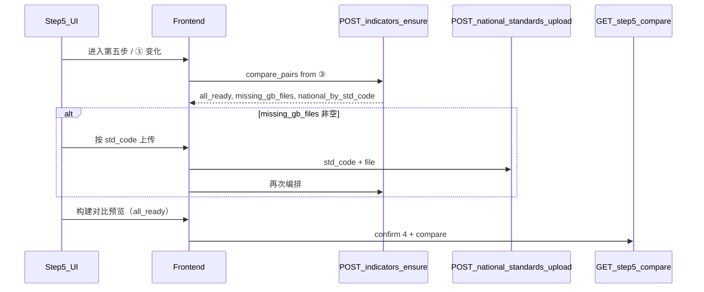

# 合规模块：第五步指标编排接口变更说明

> 文档版本：2026-05-23  
> 适用范围：前端第五步「指标映射与技术对比」、后端 `apps/compliance`  
> 关联仓库：前端 `regulation_and_evaluation_platform`；后端 `regulation_and_evaluation_platform_backend_v1.0`

---

## 1. 背景与问题

### 1.1 原行为

第五步进入后调用：

```http
GET /api/v1/compliance/evaluations/{task_id}/step/4/indicators
```

后端 `build_step4_indicators` 通过 `list_latest_side_std_codes_for_task(qb_code)` 从 **`enterprise_standard_reference_mapping` 表 DISTINCT `latest_std_code`** 得到 n+m 标准号集合，再逐号检查指标 / 国标文件 / 触发 Dify②。

### 1.2 问题

| 问题 | 说明 |
|------|------|
| 范围不一致 | 编排范围 = 映射表全量 latest，与 UI **③ 可进行指标对比的标准**（查新表两列）无关 |
| 缺件展示失真 | 用户看到 4 条「编排缺件」，与 ③ 表格中实际要对比的标准号不一致 |
| 补齐无效 | 前端曾用企标上传接口，未更新 `national_standard_basic.std_file_path`，缺件无法消除 |

### 1.3 目标行为

1. 前端将 ③ 表格中**每一行的两列标准号**（发布完整号、最新标准号；M 补充行仅最新号）提交后端。  
2. 后端对**去重后的标准号集合**编排：有指标 → 直接用；无指标有文件 → 自动 Dify② 入库；无文件 → 列入 `missing_gb_files`。  
3. 仅当 `all_ready === true` 时，前端允许「构建对比预览」。  
4. 用户按 `std_code` 调用已有 `POST /national-standards/upload` 补文件后，再调编排接口刷新。

---

## 2. 新增接口（后端待实现）

### 2.1 基本信息

| 项 | 值 |
|----|-----|
| 方法 | `POST` |
| 路径 | `/api/v1/compliance/evaluations/{task_id}/step/4/indicators/ensure` |
| 鉴权 | 与同模块其它接口一致（`COMPLIANCE_API_AUTH_REQUIRED` 时 Bearer） |
| 前置条件 | `current_step >= 4`（未完成审核 3 返回 **422**） |
| 数据库 | **要求 MySQL**（非 MySQL 可返回 **503**，与现 GET 一致） |

### 2.2 路径参数

| 参数 | 类型 | 必填 | 说明 |
|------|------|------|------|
| `task_id` | `integer` | 是 | 评价任务 ID |

### 2.3 请求体（JSON）

**`Step4IndicatorsEnsureIn`**

| 字段 | 类型 | 必填 | 说明 |
|------|------|------|------|
| `compare_pairs` | `ComparePairIn[]` | 是 | 与前端 ③ 表格行一一对应；至少 1 项 |

**`ComparePairIn`**

| 字段 | 类型 | 必填 | 说明 |
|------|------|------|------|
| `publication_std_code` | `string \| null` | 是 | 发布时引用的完整标准号（N 侧）；M 补充行为 `null` |
| `latest_std_code` | `string` | 是 | 最新标准号（N+M 侧） |

**示例**

```json
{
  "compare_pairs": [
    {
      "publication_std_code": "GB/T 4472-2011",
      "latest_std_code": "GB/T 4472-2025"
    },
    {
      "publication_std_code": null,
      "latest_std_code": "GB/T 20882.1-2025"
    }
  ]
}
```

**服务端处理规则**

1. 从 `compare_pairs` 展开：每个非空的 `publication_std_code` 与每个非空的 `latest_std_code` 加入目标集合。  
2. 对集合 **去重**（保持插入顺序或按标准号排序均可，前端不依赖顺序）。  
3. **不得**再调用 `list_latest_side_std_codes_for_task` 扩展范围。  
4. `compare_pairs` 为空数组 → **422**，`detail` 建议：`暂无可编排的标准号`。

### 2.4 响应 200（JSON）

**`Step4IndicatorsEnsureOut`**（在现有 `Step4IndicatorsOut` 上扩展）

| 字段 | 类型 | 说明 |
|------|------|------|
| `all_ready` | `boolean` | **`true` 当且仅当** `missing_gb_files` 为空 |
| `std_statuses` | `StdCodeOrchestrationStatus[]` | 每个目标标准号的编排结果（建议返回） |
| `qb_code` | `string \| null` | 同现 GET |
| `enterprise_indicators` | `array` | 企标侧指标（来自任务解析结果） |
| `national_by_std_code` | `object` | 键为 `std_code`，值为指标行数组 |
| `missing_gb_files` | `MissingGbFileItem[]` | 须用户上传国标文件的标准 |
| `dify2_invoked_std_codes` | `array` | 本次实际触发工作流②的标准号 |

**`StdCodeOrchestrationStatus`**

| 字段 | 类型 | 说明 |
|------|------|------|
| `std_code` | `string` | 标准号 |
| `std_name` | `string \| null` | 标准名称（来自 `national_standard_basic`） |
| `status` | `string` | `ready` \| `parsed_via_dify2` \| `missing_file` |
| `indicator_count` | `integer` | 编排后该标准在 `national_standard_indicator` 中的行数 |
| `reason` | `string \| null` | 仅 `missing_file` 时：`empty_std_file_path` \| `file_not_found` |

**`MissingGbFileItem`**（与现手册一致）

| 字段 | 类型 | 说明 |
|------|------|------|
| `std_code` | `string` | 标准号 |
| `std_name` | `string \| null` | 标准名称 |
| `reason` | `string` | `empty_std_file_path` \| `file_not_found` |

### 2.5 编排逻辑（与现 `build_step4_indicators` 单标准循环对齐）

对每个目标 `std_code`：

```
if national_standard_indicator 已有行:
    status = ready
    填入 national_by_std_code[std_code]
else:
    查 national_standard_basic.std_file_path
    if 无记录 or 路径空 or 文件不存在:
        加入 missing_gb_files
        status = missing_file
    else:
        调用 Dify 工作流②（或 Mock）解析落库
        status = parsed_via_dify2
        填入 national_by_std_code[std_code]
        记录 dify2_invoked_std_codes
```

**副作用**

- 更新任务 `indicator_bundle_json`（与现 GET step/4 一致），供后续 `POST step/4/confirm`、`GET step/5/compare` 使用。  
- 若触发 Dify②，更新 `dify_run_metadata_json.workflow2`（与现逻辑一致）。

### 2.6 错误响应

| HTTP | 场景 | `detail` 建议 |
|------|------|----------------|
| 422 | `current_step < 4` | `请先完成审核 3` |
| 422 | `compare_pairs` 为空 | `暂无可编排的标准号` |
| 502 | Dify② 失败 | 工作流错误信息 |
| 503 | 非 MySQL | 与现模块一致 |

---

## 3. 保留 / 不变的接口

### 3.1 `GET .../step/4/indicators`（保留，第五步不再作为主路径）

- 仍按映射表 n+m 编排，供其它调用方或管理端使用。  
- **第五步前端已改为只调 POST ensure。**

### 3.2 `POST /api/v1/compliance/national-standards/upload`

| Query | Form | 说明 |
|-------|------|------|
| `std_code`（必填） | `file`（必填） | 落盘并 `UPDATE national_standard_basic.std_file_path` |

上传成功后，前端再次调用 **POST ensure** 刷新编排。

### 3.3 `POST .../step/4/confirm` / `GET .../step/5/compare`

- 构建对比时：前端在 `all_ready` 后调用 `runBackendStep5Comparison`（内部可能 `confirm_step4` + `get_step5_compare`）。  
- `confirm_step4` 仍检查 `indicator_bundle_json.missing_gb_files` 非空则 **422**；故 ensure 必须在 confirm 前将 missing 清空。

---

## 4. 前端调用顺序（已实现）



| 步骤 | 前端函数 / 组件 | 接口 |
|------|-----------------|------|
| 生成 compare_pairs | `buildComparePairsFromDiagnostics` | — |
| 进入第五步刷新 | `refreshStep5IndicatorOrchestration` | POST ensure |
| 展示缺件 + 上传 | `TechnicalComparisonStep` | POST upload + POST ensure |
| 构建对比门闸 | `indicatorsAllReady` | POST ensure（构建前再校验一次） |
| 拉对比表 | `buildComparePreview` → `runBackendStep5Comparison` | POST confirm 4 + GET step/5/compare |

---

## 5. 前端代码映射

| 文件 | 职责 |
|------|------|
| `frontend/src/types/compliance-api.ts` | `ComparePairIn`、`Step4IndicatorsEnsureIn/Out`、`StdCodeOrchestrationStatus` |
| `frontend/src/services/compliance-api.ts` | `postStep4IndicatorsEnsure` |
| `frontend/src/services/compliance.ts` | `ensureStep4IndicatorsForCompare`、`uploadNationalStandard` 导出 |
| `frontend/src/pages/compliance/utils/step5ComparableStdCodes.ts` | 从 ③ 生成 `compare_pairs` |
| `frontend/src/pages/compliance/ComplianceWizardPanel.tsx` | 编排刷新、门闸、`uploadRepairReferenceFiles(stdCode, file)` |
| `frontend/src/pages/compliance/components/TechnicalComparisonStep.tsx` | 禁用构建按钮、按缺件 std_code 上传 |

---

## 6. 后端实现清单（待开发）

### 6.1 Schema（`backend/apps/compliance/schemas/api_schemas.py`）

- [ ] `ComparePairIn`  
- [ ] `Step4IndicatorsEnsureIn`  
- [ ] `StdCodeOrchestrationStatus`  
- [ ] `Step4IndicatorsEnsureOut`（`all_ready` + `std_statuses` + 继承现有字段）

### 6.2 服务层（`backend/apps/compliance/services/evaluation_flow.py`）

- [ ] 抽取 `_orchestrate_single_std_code(task, std_code) -> OrchestrateSingleResult`  
- [ ] 实现 `ensure_step4_indicators(task_id, compare_pairs, request)`  
- [ ] 从 `compare_pairs` 展开去重标准号（**禁止**使用 `list_latest_side_std_codes_for_task` 作为本接口输入）  
- [ ] 写 `indicator_bundle_json`、可选 `dify_run_metadata_json`  
- [ ] 计算 `all_ready = len(missing_gb_files) == 0`

### 6.3 路由（`backend/apps/compliance/api/router.py`）

- [ ] `@router.post("/evaluations/{task_id}/step/4/indicators/ensure", response=Step4IndicatorsEnsureOut)`

### 6.4 测试建议

- [ ] `compare_pairs` 两列去重： publication + latest 共 3 个唯一号  
- [ ] 已有指标的标准 → `status=ready`，不触发 Dify②  
- [ ] 有 `std_file_path` 无指标 → 触发 Dify②，`parsed_via_dify2`  
- [ ] 无路径 → `missing_gb_files`，`all_ready=false`  
- [ ] 上传国标后再次 ensure → `all_ready=true`  
- [ ] `current_step=3` → 422  

### 6.5 可选后续优化（非本期必须）

- [ ] `confirm_step3` 支持回写 `latest_std_code` 到主映射行，减少仅依赖 supplements 行  
- [ ] GET step/4 增加可选 query `scope=wizard_step5` 废弃说明  

---

## 7. 联调检查清单

1. 进入第五步，Network 出现 `POST .../step/4/indicators/ensure`，Request body 含与 ③ 表格一致的 `compare_pairs`。  
2. 响应 `missing_gb_files` 与 UI「编排缺件」列表一致（不再出现映射表多出来的标准号）。  
3. 对缺件点击「上传国标」→ `POST .../national-standards/upload?std_code=...` → 再次 POST ensure → `all_ready: true`。  
4. 「构建对比预览」「立即构建」在 `all_ready=false` 时为禁用状态。  
5. `all_ready=true` 后构建成功，出现 `GET .../step/5/compare`（及可能的 `POST .../step/4/confirm`）。  

---

## 8. 版本记录

| 日期 | 说明 |
|------|------|
| 2026-05-23 | 初版：定义 POST ensure 契约；前端第五步已按本契约接入（后端未实现前接口返回 404） |
