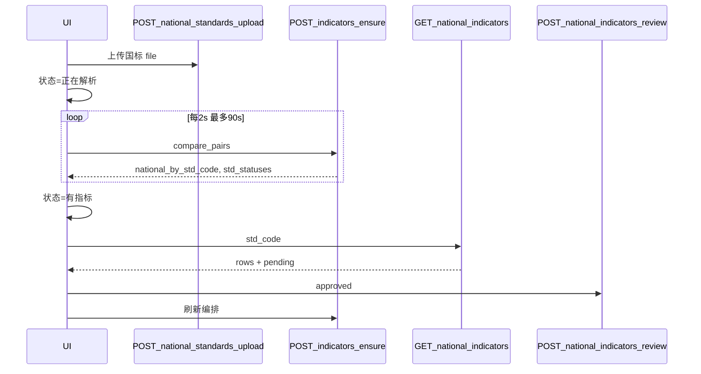

# 合规模块：第五步国标指标查询与人工审核接口说明

> 文档版本：2026-05-23  
> 前端第五步已实现：上传后「正在解析」轮询、有指标「查看/审核」弹窗。本文档为**后端待实现/待增强**清单。

---

## 1. 背景

| 场景 | 前端行为 | 依赖后端 |
|------|----------|----------|
| 无指标 → 上传国标 | 关闭弹窗 → 列表显示 **正在解析** → 轮询 `POST ensure` → 无感变为 **有指标** | 上传 + ensure 触发 Dify② |
| 有指标 → 点击查看 | 弹窗展示 indexes JSON 解析结果 + `manual_review_status` | 查询接口 + 审核接口 |
| 解析入库 | Dify② 写入 `national_standard_indicator`，`manual_review_status='pending'` | 已有逻辑，需 SELECT 带出 status |

数据模型（现有）：

- 表 `national_standard_indicator`：每个 `std_code` **通常一行**，`specific_indicator_value` 为 **indexes 数组的 JSON 字符串**
- 字段 `manual_review_status`：`pending` | `approved` | `rejected`
- Dify② 入库见 `evaluation_flow._upsert_national_indicator_json`（固定 `pending`）

---

## 2. 现有接口需增强（非新路由）

### 2.1 `POST .../step/4/indicators/ensure` 响应

`national_by_std_code[std_code]` 每项除 `id`、`std_code`、`specific_indicator_value` 外，**必须**包含：

| 字段 | 类型 | 说明 |
|------|------|------|
| `manual_review_status` | `pending` \| `approved` \| `rejected` \| null | 供前端弹窗展示与审核按钮状态 |

修改 `_fetch_national_indicator_rows`：

```sql
SELECT id, std_code, specific_indicator_value, manual_review_status
FROM national_standard_indicator WHERE std_code = %s
```

### 2.2 `all_ready` 语义建议（可选产品规则）

当前前端以 `all_ready === true` 作为「构建对比预览」门闸。若要求 **指标须人工审核通过后才能对比**，建议：

- `all_ready = true` 当且仅当：③ 涉及标准号均已有指标行，且 `manual_review_status = 'approved'`（或业务约定 approved 才参与 Dify③）

否则前端可继续仅用 `missing_gb_files` 为空作为 `all_ready`，审核与对比解耦。

---

## 3. 新增接口一：查询国标指标明细

### `GET /api/v1/compliance/evaluations/{task_id}/step/4/national-indicators`

**Query**

| 参数 | 必填 | 说明 |
|------|------|------|
| `std_code` | 是 | 标准号 |

**响应 200**：`NationalIndicatorListOut`

```json
{
  "std_code": "GB/T 20882.1-2025",
  "std_name": "淀粉糖质量要求 第1部分：食用葡萄糖",
  "rows": [
    {
      "id": 12345,
      "std_code": "GB/T 20882.1-2025",
      "specific_indicator_value": "[{\"index_name\":\"...\",\"index_type\":\"...\",\"index_content\":{}}]",
      "manual_review_status": "pending"
    }
  ]
}
```

**错误**

| HTTP | 说明 |
|------|------|
| 422 | `std_code` 为空 |
| 404 | 无该标准指标记录（可选） |

**实现要点**

- `std_name` 来自 `national_standard_basic`
- `rows` 为该 `std_code` 下全部 `national_standard_indicator` 行（通常 1 行）

---

## 4. 新增接口二：人工审核国标指标

### `POST /api/v1/compliance/evaluations/{task_id}/step/4/national-indicators/review`

**Body（JSON）**

```json
{
  "std_code": "GB/T 20882.1-2025",
  "manual_review_status": "approved"
}
```

| 字段 | 必填 | 说明 |
|------|------|------|
| `std_code` | 是 | 标准号 |
| `manual_review_status` | 是 | `approved` 或 `rejected`（可选支持改回 `pending`） |

**响应 200**：`NationalIndicatorReviewOut`

```json
{
  "id": 12345,
  "std_code": "GB/T 20882.1-2025",
  "manual_review_status": "approved"
}
```

**实现要点**

```sql
UPDATE national_standard_indicator
SET manual_review_status = %s
WHERE std_code = %s
```

若业务为「每 std_code 仅一行」，按 `std_code` 更新即可。

审核成功后建议：可选调用 `ensure` 同逻辑刷新 `indicator_bundle_json`，或依赖前端再次 `POST ensure`。

---

## 5. 新增接口三：保存编辑后的指标 JSON

> 前端「国标指标明细」弹窗已提供 **编辑 / 保存**，将表格行序列化回 `specific_indicator_value`（indexes 数组 JSON）。**`manual_review_status` 不因保存而变更**（仍为 `pending`，需单独调用 review 审核通过）。

### `PUT /api/v1/compliance/evaluations/{task_id}/step/4/national-indicators`

**Body（JSON）**

```json
{
  "std_code": "GB/T 20882.1-2025",
  "specific_indicator_value": "[{\"index_name\":\"外观\",\"index_type\":\"定性\",\"index_content\":\"无色透明液体\"}]"
}
```

| 字段 | 必填 | 说明 |
|------|------|------|
| `std_code` | 是 | 标准号 |
| `specific_indicator_value` | 是 | 完整 indexes JSON 字符串（与 Dify② 入库格式一致） |

**响应 200**：`NationalIndicatorSaveOut`

```json
{
  "id": 12345,
  "std_code": "GB/T 20882.1-2025",
  "specific_indicator_value": "[...]",
  "manual_review_status": "pending"
}
```

**实现要点**

```sql
UPDATE national_standard_indicator
SET specific_indicator_value = %s
WHERE std_code = %s
```

- 校验 `specific_indicator_value` 为合法 JSON 且为数组（可选逐条校验 `index_name` / `index_type` / `index_content`）
- `rowcount = 0` 时返回 404
- 不建议在保存时自动 `approved`；审核仍走 `POST .../review`

---

## 6. 与上传、编排的协作时序



---

## 7. 前端已实现（联调对照）

| 文件 | 说明 |
|------|------|
| `ComparablePairsTable.tsx` | 正在解析 / 有指标·查看 / 无指标·去处理 |
| `MissingGbDetailModal.tsx` | 无指标上传 |
| `NationalIndicatorReviewModal.tsx` | 指标明细 + **编辑/保存** + 审核通过（已移除驳回） |
| `ComplianceWizardPanel.tsx` | 上传后 `parsingStdCodes` + 轮询 ensure |
| `compliance-api.ts` | `getNationalIndicatorsByStd`、`putNationalIndicatorSave`、`postNationalIndicatorReview` |

GET/PUT/POST 未实现时：指标弹窗回退 ensure 缓存的 `national_by_std_code`；保存/审核接口报错提示后端未就绪。

---

## 8. 后端实现清单

- [ ] `_fetch_national_indicator_rows` 增加 `manual_review_status`
- [ ] `GET .../step/4/national-indicators?std_code=`
- [ ] `POST .../step/4/national-indicators/review`
- [ ] `PUT .../step/4/national-indicators`（保存 `specific_indicator_value`）
- [ ] （可选）`all_ready` 纳入 `approved` 判定
- [ ] 单测：上传 → ensure → GET 为 pending → PUT 编辑 → review approved → ensure 仍为 ready

---

## 9. 版本记录

| 日期 | 说明 |
|------|------|
| 2026-05-23 | 初版：配合第五步上传解析态轮询与指标审核弹窗 |
| 2026-05-23 | 弹窗改为编辑/保存；补充 PUT 保存指标 JSON 契约 |
