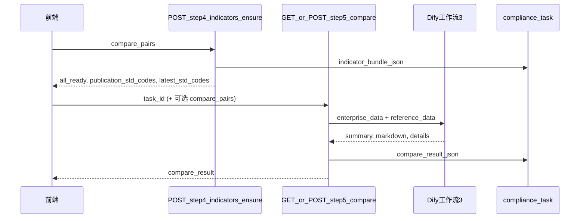

# 合规模块第五步：工作流③ 指标对比 — 数据拼装与接口说明

> **文档版本**：2026-05-24  
> **读者**：后端开发、Dify 工作流③ 配置同事  
> **前端仓库**：`regulation_and_evaluation_platform`（已按本文档对接 `compare_pairs`、可选 `POST step/5/compare`）  
> **关联文档**：[指标编排 ensure](backend-compliance-step5-indicator-ensure-API变更说明.md)、[国标指标审核/保存](backend-compliance-step5-national-indicator-API-后端补充说明.md)

---

## 1. 业务目标

用户点击第五步 **「构建对比预览」** 后：

1. 前端提交 ③「可进行指标对比的标准」中每一行的 **发布时完整国标号（N 侧）** 与 **最新标准号（N+M 侧，含补充 M）**。
2. 后端对涉及标准号 **逐号查库**（`national_standard_indicator`），缺件则走 Dify② 解析入库，拼出两份国标指标明细。
3. 调用 **工作流③** 前组装两个 JSON 入参：
   - **`enterprise_data`**：工作流①企标指标 + **发布时点 N 侧**国标指标（分层 `publication_side`）。
   - **`reference_data`**：**仅最新 N+M 侧**国标指标（`latest_side`）。
4. 工作流③ 输出对比结论 → 写入 `compare_result_json` → 返回前端展示 Markdown 表。



---

## 2. 前端提交数据（已实现）

### 2.1 `POST /api/v1/compliance/evaluations/{task_id}/step/4/indicators/ensure`

**Body：`Step4IndicatorsEnsureIn`**

```json
{
  "compare_pairs": [
    {
      "publication_std_code": "GB 10035-2006",
      "latest_std_code": "GB/T 20882.1-2025"
    },
    {
      "publication_std_code": null,
      "latest_std_code": "GB/T 1628-2020"
    }
  ]
}
```

| 字段 | 说明 |
|------|------|
| `publication_std_code` | ④ 查新表「发布时引用的完整标准号」；**M 补充行为 `null`** |
| `latest_std_code` | ④ 最新标准号或补充 M 标准号 |

**服务端派生（须写入 `indicator_bundle_json` 并可在响应中返回）**

| 字段 | 规则 |
|------|------|
| `publication_std_codes` | 所有非空 `publication_std_code` 去重（**不含 M**） |
| `latest_std_codes` | 所有非空 `latest_std_code` 去重（**含 M**） |
| 编排目标集合 | `publication_std_codes ∪ latest_std_codes` 去重 |

**编排逻辑**（与现 `ensure_step4_indicators` 一致）：

- 有指标行 → `ready`，填入 `national_by_std_code[std_code]`。
- 无指标、有国标文件 → Dify② → `parsed_via_dify2`。
- 无文件 → `missing_gb_files`，`all_ready=false`。

**响应扩展字段 `Step4IndicatorsEnsureOut`**

| 字段 | 类型 | 说明 |
|------|------|------|
| `all_ready` | bool | `missing_gb_files` 为空 |
| `publication_std_codes` | string[] | N 侧发布时点标准号列表 |
| `latest_std_codes` | string[] | N+M 最新侧标准号列表 |
| `national_by_std_code` | object | 全部目标标准号的指标行 |
| `enterprise_indicators` | array | 工作流①企标指标 |
| `std_statuses` | array | 每号编排状态 |
| `missing_gb_files` | array | 缺件列表 |

---

## 3. 两份国标指标明细（库内拼装）

| 部分 | 标准号来源 | bundle 用途 |
|------|------------|-------------|
| **第一部分** 发布时点 N | `publication_std_codes` | 进入 **`enterprise_data.publication_side`** |
| **第二部分** 最新 N+M | `latest_std_codes` | 进入 **`reference_data.latest_side`** |
| **企标** 工作流① | 任务解析结果 `enterprise_indicators` | 进入 **`enterprise_data.enterprise_indicators`** |

每条国标指标来自 `national_standard_indicator.specific_indicator_value`（indexes JSON 字符串），与 Dify② 入库格式一致。

---

## 4. 工作流③ 入参契约（核心）

Dify 客户端方法：`run_workflow_3_index_compare(enterprise_data=..., reference_data=...)`，二者均为 **JSON 字符串**。

### 4.1 `enterprise_data`（分层结构，已确认）

```json
{
  "qb_code": "Q/ABC 001-2026",
  "enterprise_indicators": [
    {
      "name": "外观",
      "value": "褐色液体"
    }
  ],
  "publication_side": {
    "label": "发布时引用的国标指标（N侧）",
    "std_codes": ["GB 10035-2006", "GB/T 4472-2011"],
    "national_by_std_code": {
      "GB 10035-2006": [
        {
          "id": 101,
          "std_code": "GB 10035-2006",
          "specific_indicator_value": "[{\"index_name\":\"外观\",...}]",
          "manual_review_status": "approved"
        }
      ]
    }
  }
}
```

**实现函数**：`_build_workflow3_enterprise_data(bundle, qb_code)`  
**说明**：`publication_side` 仅含 `publication_std_codes` 子集，**不得**包含 M 或仅-latest 的标准号。

### 4.2 `reference_data`（仅最新侧）

```json
{
  "latest_side": {
    "label": "最新国标指标（N+M侧，含补充M）",
    "std_codes": ["GB/T 20882.1-2025", "GB/T 1628-2020"],
    "national_by_std_code": {
      "GB/T 20882.1-2025": [ { "id": 201, "std_code": "GB/T 20882.1-2025", "specific_indicator_value": "..." } ],
      "GB/T 1628-2020": [ { "id": 202, "std_code": "GB/T 1628-2020", "specific_indicator_value": "..." } ]
    }
  }
}
```

**实现函数**：`_build_workflow3_reference_data(bundle)` — **仅返回上述结构，不含 `publication_side`**。

### 4.3 与旧实现的差异

| 项目 | 旧行为 | 新行为 |
|------|--------|--------|
| `enterprise_data` | 仅 `qb_code` + `enterprise_indicators` | 增加 `publication_side` |
| `reference_data` | 同时含 `publication_side` + `latest_side` | **仅** `latest_side` |

**Dify③ Prompt** 须同步：对比基准为「企标 + 发布时点国标」vs「最新国标」。

### 4.4 字符截断

环境变量 `DIFY_WORKFLOW3_MAX_INPUT_CHARS`（默认 48000）对 `enterprise_data`、`reference_data` 分别截断并追加 `…[truncated]`。分侧后 payload 更大，必要时按 `std_codes` 优先级裁剪或摘要。

---

## 5. 对比接口

### 5.1 `GET /api/v1/compliance/evaluations/{task_id}/step/5/compare`

| 项 | 值 |
|----|-----|
| 方法 | GET |
| Body | 无 |
| 前置 | `current_step == 5`；`step4_indicators_confirmed == true`；`indicator_bundle_json` 非空；`latest_std_codes` 非空；`missing_gb_files` 为空 |
| 副作用 | 调用 Dify③；更新 `compare_result_json`、`dify_run_metadata_json.workflow3` |
| 响应 | `{ "compare_result": { "summary", "details", "markdown", ... } }` |

### 5.2 `POST /api/v1/compliance/evaluations/{task_id}/step/5/compare`（推荐，前端构建时已对接）

| 项 | 值 |
|----|-----|
| 方法 | POST |
| Body | 可选 `Step5CompareIn` |

**`Step5CompareIn`**

```json
{
  "compare_pairs": [
    { "publication_std_code": "GB 10035-2006", "latest_std_code": "GB/T 20882.1-2025" }
  ]
}
```

| 字段 | 必填 | 说明 |
|------|------|------|
| `compare_pairs` | 否 | 若提供：先执行与 ensure 相同的编排并刷新 `indicator_bundle_json`，再调 Dify③；保证与当前 ③ 表格一致 |

**处理顺序**

1. `compare_pairs` 非空 → `ensure_step4_indicators(task_id, body)`（或内部复用编排逻辑）。
2. `missing_gb_files` 非空 → **422**。
3. `current_step < 5` 且未 confirm 4 → 可先 `confirm_step4`（与现前端 `runBackendStep5Comparison` 一致）。
4. 拼装 `enterprise_data` / `reference_data` → Dify③ → 落库 → 返回 `Step5CompareOut`。

**响应 200**：同 GET。

### 5.3 `compare_result` 与前端表格

前端解析 `compare_result.markdown`（工作流③ 输出），表头约定：

| 列序 | 表头 | 前端字段 |
|------|------|----------|
| 1 | 序号 | `rowNo` |
| 2 | 指标类别 | `indicatorCategory` |
| 3 | 指标名称 | `indicatorName` |
| 4 | 企标限值 | `enterpriseValue` |
| 5 | 规范性引用标准号 | `referenceStdCode` |
| 6 | 国标限值 | `matchedStandard` |
| 7 | 单项结果 | `nationalValue` |
| 8 | 判决备注 | `compareNote` |

`details` 数组非空时优先解析 `details`（字段名见前端 `step5CompareParse.ts`）。

---

## 6. 数据库持久化

| 字段 | 表/模型 | 内容 |
|------|---------|------|
| `indicator_bundle_json` | `ComplianceEvaluationTask` | ensure 结果：`compare_pairs`、`publication_std_codes`、`latest_std_codes`、`national_by_std_code`、`enterprise_indicators` 等 |
| `compare_result_json` | 同上 | 工作流③ 完整返回（含 `markdown`） |
| `dify_run_metadata_json.workflow3` | 同上 | Dify 运行元数据 |
| `step4_indicators_confirmed` | 同上 | 审核 4 确认后为 true |

---

## 7. 错误码

| HTTP | 场景 |
|------|------|
| 422 | 不在步骤 5；未 confirm 4；bundle 空；无 `latest_std_codes`；`missing_gb_files` 非空 |
| 502 | Dify③ 调用失败 |
| 503 | 非 MySQL（与模块其它接口一致） |

---

## 8. 后端实现清单（`evaluation_flow.py`）

- [x] `_split_compare_pairs_to_sides` / `_resolve_compare_sides_from_bundle`
- [x] `ensure_step4_indicators` 持久化 `publication_std_codes`、`latest_std_codes`
- [x] `_build_workflow3_enterprise_data` — 企标 + `publication_side`
- [x] `_build_workflow3_reference_data` — **仅** `latest_side`
- [x] `run_step5_compare` 使用上述两函数
- [x] POST body 带 `compare_pairs` 时先 ensure 再对比
- [x] 单测：`test_build_workflow3_enterprise_data_includes_publication_side`、`test_build_workflow3_reference_data_latest_side_only`
- [x] 路由：`POST .../step/5/compare`

---

## 9. 联调检查清单

1. 第四步补充 M 后，`compare_pairs` 含 `publication_std_code: null` 行；ensure 响应 `latest_std_codes` 含 M，`publication_std_codes` 不含 M。
2. `indicator_bundle_json.publication_std_codes` / `latest_std_codes` 与 ③ 表格一致。
3. 抓包或日志：`enterprise_data` 含 `publication_side`；`reference_data` **无** `publication_side`。
4. 构建成功后 `compare_result.markdown` 行数 > 0，指标名称为「外观、pH…」而非序号。
5. 前端「导出 Excel」子表 1/2/3 与两侧标准号一致。

---

## 10. 版本记录

| 日期 | 说明 |
|------|------|
| 2026-05-24 | 初版：分侧拼装契约；enterprise 分层；reference 仅 latest；POST compare 可选 body |
