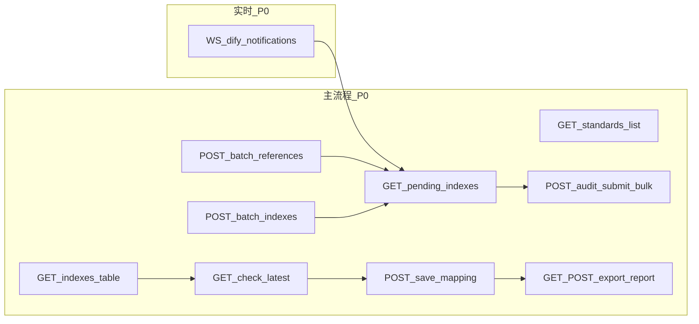

# 合规性评价模块：后端接口需求说明（供新后端开发）

> **已过时**：前端已对接新后端 **`/api/v1/compliance`**，请以 **[backend-compliance-API-前端对接手册.md](./backend-compliance-API-前端对接手册.md)** 为准；下文保留仅为历史参考。

本文档根据旧版前端实现整理，对应代码入口（多数路径已由 `compliance-api.ts` 替代）：

| 说明 | 路径 |
|------|------|
| 合规首页（任务卡片、上传、导出、轮询） | `frontend/src/pages/compliance/index.tsx` |
| 六步向导（上传、描述性评价、双表审核、引用有效性、指标对比、总结与报告） | `frontend/src/pages/compliance/ComplianceWizardPanel.tsx` |
| HTTP 封装（路径常量、请求/响应处理） | `frontend/src/services/compliance.ts` |
| 异步推送（WebSocket） | `frontend/src/pages/compliance/hooks/useDifyNotifications.ts` |
| 任务类型（部分接口期望与之一致） | `frontend/src/types/compliance.ts` |

**前端 HTTP 前缀**：`axios` 的 `baseURL` 默认为 `/api`（见 `frontend/src/services/request.ts`）。下文「路径」均指 **相对 `baseURL`**，全路径示例为 `https://{host}/api{path}`。

**说明**：若新后端统一更换 URL，只需与前端约定后修改 `compliance.ts` 中的常量；本文档描述的是**当前前端已写死的相对路径与解析逻辑**，便于你们实现等价或更优契约。

---

## 1. 业务与接口分层



| 优先级 | 含义 |
|--------|------|
| **P0** | 合规首页与向导主链已调用；缺一则核心流程不可用或严重降级。 |
| **P1** | `compliance.ts` 已封装，向导页当前未 `import`；产品若扩展工作台可直调。 |
| **P2** | `useComplianceTask` 等 hooks 引用，但 `create/update/delete` 在 service 内仍为抛错占位；若做「合规任务中心」需新接口。 |

---

## 2. 接口总览

| 优先级 | 方法 | 路径（相对 `/api`） | 前端函数名 | 主用途 |
|--------|------|---------------------|------------|--------|
| P0 | GET | `/standards/` | `getComplianceTasks` | 首页「任务」列表映射 |
| P0 | GET | `/standards/{id}/` | `getComplianceTask` | 单条详情（hooks；形状宜与列表一致） |
| P2 | POST/PATCH/DELETE | （待定） | `createComplianceTask` 等 | 任务 CRUD 占位 |
| P0 | POST | `/standards/batch-references/` | `uploadEnterpriseStandard` | 企标上传 → 规范性引用解析 |
| P0 | POST | `/standards/batch-indexes/` | `postInsertIndexes` | 企标上传 → 指标入专用表 |
| P0 | GET | `/audit/pending_indexes/` | `getPendingIndexes` | 待审核指标列表（双表审核 + 轮询） |
| P0 | POST | `/audit/submit/` | `submitAuditDecision` | 单条审核 / 带修正通过 |
| P0 | POST | `/audit/bulk_submit/` | `submitAuditBulkDecision` | 批量审核 |
| P0 | GET | `/indexes_table/` | `getNationalIndexes` | 指标库；支持 `bz_id` |
| P0 | GET | `/standards/check-latest/` | `checkLatestStandard` | 引用标准是否现行最新 |
| P0 | POST | `/save_mapping/` 或 `/mapping/save/` | `saveReferenceMapping` | 旧引用 → 现行标准映射 |
| P0 | GET | `/standards/export-report/` | `exportComplianceReport` | 单份报告 blob |
| P0 | POST | `/standards/export-report/` | `exportComplianceReportBatch` | 批量报告 blob |
| P1 | GET | `/standards/basic-search/` | `getStandardsBasicSearch` | 关键字搜索 |
| P1 | GET | `/standards/warning-trace/` | `getStandardsWarningTrace` | 预警追溯 |
| P1 | GET | `/standards/dashboard-alerts/` | `getStandardsDashboardAlerts` | 仪表盘提醒 |
| P1 | GET | `/standards/statistics/` | `getStandardsStatistics` | 统计 |
| P1 | GET | `/standards/download-doc/` | `downloadStandardDoc` | 标准 PDF |
| P1 | POST | `/analyze_qb_references_auto/` | `analyzeQbReferencesAuto` | 旧版企标解析 |
| P1 | GET | `/dify/preface-diff/` | `getDifyPrefaceDiff` | 前言差异 |
| P1 | GET | `/get_tree_data/` | `getTreeData` | 谱系树 |
| P1 | POST | `/check_references/` | `checkReferencesComparison` | 规范性引用比对 |
| P1 | POST | `/insert_anti_warn/` | `postInsertAntiWarn` | 引用/预警链落库 |

**WebSocket（P0）**：见第 10 节。

---

## 3. 列表类响应通用约定

以下接口的 **HTTP 响应体**（即 `axios` 的 `response.data`）前端用同一函数 `normalizeList` 归一化：

- 直接为 **JSON 数组** `T[]`，或
- 对象 **`{ results: T[] }`**，或
- 对象 **`{ data: T[] }`**

若新后端统一为 `{ code, msg, data: { results: [...] } }` 等形式，需在前端 `normalizeList` 处增加一层解包，或由后端在评审时约定「列表始终在 `response.data.results`」并同步改前端。

---

## 4. P0 接口详述

### 4.1 `GET /standards/` — 合规首页「任务列表」数据源

| 项目 | 说明 |
|------|------|
| **功能** | 拉取标准/任务列表，映射为前端 `ComplianceTask[]` 用于首页卡片「任务总数」及列表展示。 |
| **请求** | 无必填 Query（可与标准库列表共用分页参数；当前前端未传分页参数）。 |
| **期望响应体** | 见上文「列表类响应通用约定」；列表元素为对象，字段经前端 `toComplianceTask` 映射（见下表）。 |
| **字段映射（列表元素 → 前端 `ComplianceTask`）** | |

| 前端字段 | 说明 | 后端字段（按优先级 fallback） |
|----------|------|----------------------------------|
| `id` | 字符串 | `id` → `bz_id` |
| `name` | 任务/标准名称 | `bz_name` → `name` → `title` |
| `enterprise` | 展示用企业/机构 | `draft_org` → `org_name` → `enterprise` |
| `status` | `pending` \| `processing` \| `completed` \| `failed` | 由 `status` **文本**推断：含「现行」或 `active`→completed；含「即将」或 `processing`→processing；含「废止」或 `invalid`→failed；否则 pending |
| `progress` | 0 / 50 / 100 | 由映射后的 `status` 推导 |
| `createTime` | 字符串 | `created_at` → `publish_date` |
| `deadline` | 字符串 | `impl_date` → `effective_date` |
| `evaluator` | 字符串 | `evaluator`，缺省 `-` |
| `steps` | 当前恒为 `[]` | 可预留，后端若返回步骤数组可后续接 |

| **错误** | 404：前端抛「后端未提供接口」类提示（`with404Hint`）。 |

| **后端建议** | 若「合规任务」与「标准库列表」模型分离，可提供专用 `GET /compliance/tasks/` 等，并与前端约定字段名；否则保持与本表兼容可减少前端改动。 |

---

### 4.2 `GET /standards/{id}/` — 单条任务/标准详情

| 项目 | 说明 |
|------|------|
| **功能** | `useComplianceTask` hook 拉取单条；期望反序列化为 `ComplianceTask`。 |
| **请求** | 路径参数 `id`（与列表项 `id` 一致）。 |
| **期望响应体** | 与 `ComplianceTask` 一致或子集 + 扩展字段；若实际是标准库详情 DTO，建议后端提供与 **4.1 列表项** 一致的视图模型，或接受前端后续增加映射层。 |
| **类型参考** | `frontend/src/types/compliance.ts` → `ComplianceTask` |

---

### 4.3 `POST /standards/batch-references/` — 企标文件：规范性引用解析

| 项目 | 说明 |
|------|------|
| **功能** | 上传企标文档，触发后台解析（Celery/Dify 等）；首页弹窗与向导第 1 步、「修复上传」均会调用。 |
| **Content-Type** | `multipart/form-data` |
| **表单字段** | 为兼容不同后端约定，前端会同时发送：<br>• `file`：第一个文件（单文件场景）<br>• `files`：每个文件 append 一次<br>• `files[]`：每个文件 append 一次<br>• 可选 `bz_id`：企标编号（string，trim 后） |
| **成功响应** | 无强制 JSON 结构；前端会尝试从 `response.data` 递归解析出「待审核行」形态（见 `extractIndicatorsFromUnknown` / 向导内 `extractPendingRowsFromUploadPayload`）。**若无可解析结构**，则依赖 `GET /audit/pending_indexes/` 轮询与 WebSocket。 |
| **错误** | **405**：前端提示「需在该路径开放 POST」。 |

---

### 4.4 `POST /standards/batch-indexes/` — 企标文件：技术指标入专用表

| 项目 | 说明 |
|------|------|
| **功能** | 与 4.3 **并行**上传同一文件；指标写入专用表，初始待审核（业务上常 `status=0`）。 |
| **请求** | 与 **4.3** 相同的 `multipart` 字段约定。 |
| **成功响应** | 同 4.3，无强制结构；失败/成功以 HTTP 状态与业务错误体为准。 |
| **错误** | **405**：前端提示需开放 POST。 |

---

### 4.5 `GET /audit/pending_indexes/` — 待审核指标列表

| 项目 | 说明 |
|------|------|
| **功能** | 向导第 3 步「规范性引用 + 企标指标」双表数据源；首页上传后轮询；WebSocket 收到事件后刷新。 |
| **请求** | 当前无 Query（若数据量大，建议后端支持分页/过滤并与前端约定）。 |
| **响应体** | 列表包裹约定见上文；元素映射为 `PendingIndexItem`： |

| 逻辑字段 | 必填 | 后端字段候选（依次 fallback） |
|----------|------|----------------------------------|
| `id` | **是**（审核、内联修正依赖） | `id`（字符串或数字均可，前端 `String()`） |
| `standardName` | 展示 | `bz_name`、`standard_name`、`standard`、`bz_id` |
| `indicatorName` | 展示 | `indicator_name`、`index_name`、`name`、`metric_name` |
| `indicatorValue` | 展示 | `indicator_value`、`index_context`、`value`、`content`（可为 JSON，前端展平为可读文本） |
| `statusText` | 展示 | 若 `status` 为数字：`0`→待审核，`1`→审核通过，`2`→审核驳回；否则 `status_text` 或字符串 `status` |

---

### 4.6 `POST /audit/submit/` — 单条审核（含可选「修正后通过」）

| 项目 | 说明 |
|------|------|
| **功能** | 单条通过/驳回；内联编辑保存时以 **通过** 提交并携带修正字段。 |
| **Content-Type** | `application/json` |
| **请求体（固定）** | |

```json
{
  "id": "<待审核记录 id，与 4.5 列表一致>",
  "action": "approve | reject"
}
```

| **可选扩展字段**（内联修正，`action` 为 `approve` 时） | |

| 字段 | 类型 | 说明 |
|------|------|------|
| `modified_bz_id` | string | 前端用「标准名/标准号」列承载，可为修正后的标准号 |
| `modified_index_name` | string | 修正后的指标名 |
| `modified_content` | object | 至少 `{ "indicator_value": "<新指标值字符串>" }` |

| **成功响应** | 2xx 即可；前端成功后重新 `GET /audit/pending_indexes/`。 |
| **建议** | 返回体可带更新后的记录或 `message`，便于 toast。 |

---

### 4.7 `POST /audit/bulk_submit/` — 批量审核

| 项目 | 说明 |
|------|------|
| **功能** | 向导第 3 步对企标指标表、规范性引用表分别「一键通过/驳回」。 |
| **请求体** | |

```json
{
  "ids": ["id1", "id2"],
  "action": "approve | reject"
}
```

| **成功响应** | 2xx；前端刷新 `pending_indexes`。 |

---

### 4.8 `GET /indexes_table/` — 指标库

| 项目 | 说明 |
|------|------|
| **功能** | 上传前后对比「新增行」判断解析是否完成；第 4 步校验人工填写的「最新标准号」是否已有指标；第 5 步按多个 `bz_id` 拉取指标做技术对比。 |
| **Query** | 可选 `bz_id`（string）：按企标/国标号过滤。**注意**：前端在传入 `bz_id` 时还会对返回列表再过滤 `standardId === bz_id`（防后端返回范围过大）。 |
| **响应体** | 列表包裹约定见上文；元素映射为 `NationalIndexItem`： |

| 逻辑字段 | 后端字段候选 |
|----------|----------------|
| `id` | `id` |
| `standardId` | `bz_id`、`standard_id`、`standard` |
| `indexName` | `index_name`、`indicator_name`、`name` |
| `indexValue` | `index_context`、`indicator_value`、`value`、`content` |
| `singleResult` | `single_result`、`comparison_result`、`compliance_result`、`judge_result`、`result` |
| `matchStatus` | `match_status`、`mapping_status`、`matching_status` |

---

### 4.9 `GET /standards/check-latest/` — 引用标准是否现行最新

| 项目 | 说明 |
|------|------|
| **功能** | 第 4 步对引用标准批量校验；第 5 步辅助解析「现行标准号」。 |
| **Query** | **`bz_id`**（必填）：被查询的标准号。 |
| **期望 JSON 根对象字段** | |

| 字段 | 类型 | 说明 |
|------|------|------|
| `query_bz_id` | string | 可选；缺省前端用请求中的 `bz_id` |
| `is_latest` | boolean | 是否已指向现行有效版本 |
| `current_latest_id` | string | 现行标准编号（用于映射目标） |
| `pedigree_chain` | string | 更替链/说明文本 |

前端读取：`response.data` 即上述对象（若包在 `data` 里，需与现有 axios 拦截器一致；当前代码按 **根即业务 JSON** 读取）。

---

### 4.10 `POST /save_mapping/` 与 `POST /mapping/save/` — 引用映射落库

| 项目 | 说明 |
|------|------|
| **功能** | 第 4 步「人工确认数据完整并同步映射」：每一行将「引用标准」映射到「现行标准」。 |
| **请求体** | |

```json
{
  "enterprise_bz_id": "<向导中填写的被替换标准号 queryBzId>",
  "national_bz_id": "<现行标准号 currentLatestId>"
}
```

| **语义说明** | 键名沿用历史命名：`enterprise_bz_id` 在向导里表示 **引用标准号**（不一定是企业主体 ID）。新后端若语义更清晰，可改用新键名并 **同步改前端** `SaveMappingPayload` 与调用处。 |
| **调用顺序** | 先 `POST /save_mapping/`；若 **404** 再 `POST /mapping/save/`（同一 JSON）。 |
| **成功响应** | 2xx。 |

---

### 4.11 `GET /standards/export-report/` — 导出单份合规报告

| 项目 | 说明 |
|------|------|
| **功能** | 首页与向导导出 Excel（或约定类型）到本机。 |
| **Query** | **`bz_id`**（必填）。 |
| **成功响应** | **二进制流**；`Content-Type` 为 Excel 或 `application/octet-stream`。 |
| **响应头** | **`Content-Disposition`**：`filename="..."` 或 RFC5987 `filename*=UTF-8''...`，供前端生成下载文件名。 |

---

### 4.12 `POST /standards/export-report/` — 批量导出报告

| 项目 | 说明 |
|------|------|
| **功能** | 多标准号一次导出（blob）。 |
| **Content-Type** | `application/json` |
| **请求体** | `{ "bz_ids": ["Q/XXX 1-2026", "GB/T 1.1-2020"] }` |
| **成功响应** | 同 4.11：blob + `Content-Disposition`（若为 zip 需约定 `Content-Type`）。 |

---

## 5. P2：合规任务 CRUD（当前占位，建议新资源）

以下方法在 `compliance.ts` 中 **抛错**，`useComplianceTask` 依赖其实现后才能真正使用。

### 5.1 `POST /compliance/tasks/`（建议路径）

| 项目 | 说明 |
|------|------|
| **功能** | 创建合规任务。 |
| **请求体** | 对齐 `CreateComplianceTaskRequest`：`name`, `enterpriseId`, `enterpriseName`, `standardFileId`, `evaluatorId`, `evaluatorName`, `deadline?` |
| **响应** | 建议返回创建后的任务对象（与列表 DTO 一致）。 |

### 5.2 `PATCH /compliance/tasks/{id}/`（建议）

| **请求体** | `Partial<ComplianceTask>` 或与后端约定字段。 |

### 5.3 `DELETE /compliance/tasks/{id}/`（建议）

| **响应** | 204 或带 `message` 的 JSON。 |

### 5.4 与 `GET /standards/{id}/` 的关系

当前 `getComplianceTask` 仍指向 **`GET /standards/{id}/`**。若新后端有独立任务资源，请提供 `GET /compliance/tasks/{id}/` 并改前端常量；响应体建议与 **4.1** 列表项或 `ComplianceTask` 对齐。

---

## 6. P1：扩展接口（已封装，向导未引用）

实现后可在合规或其它页面直接调用 `compliance.ts` 中对应函数，无需先改 UI。

### 6.1 `GET /standards/basic-search/`

- **Query**：`q`（string，trim）。
- **响应**：前端未做强类型解析，建议返回可展示列表或 `{ code, data }` 并与全局约定一致。

### 6.2 `GET /standards/warning-trace/`

- **Query**：`bz_id`（必填）。
- **响应**：追溯结构由后端定义。

### 6.3 `GET /standards/dashboard-alerts/`

- **响应**：提醒列表结构由后端定义。

### 6.4 `GET /standards/statistics/`

- **响应**：统计数据，供大屏类页面使用。

### 6.5 `GET /standards/download-doc/`

- **Query**：`bz_id`（必填）。
- **响应**：PDF **blob**。

### 6.6 `POST /analyze_qb_references_auto/`

- **Body**：`multipart/form-data`，字段 `file`。
- **响应**：解析任务入队或结果 JSON，由后端定义。

### 6.7 `GET /dify/preface-diff/`

- **Query**：`bz_id`（必填）。
- **响应**：前言差异 JSON。

### 6.8 `GET /get_tree_data/`

- **Query**：`bz_id`（必填）。
- **响应**：谱系图 `nodes`/`links` 等，与标准库页一致为佳。

### 6.9 `POST /check_references/`

| 项目 | 说明 |
|------|------|
| **请求体** | |

```json
{
  "qibiao_release_date": "ISO 或 yyyy-MM-dd 字符串",
  "references": [
    {
      "standard_id": "GB/T 1.1-2020",
      "has_year": true,
      "full_text": "引用原文片段"
    }
  ]
}
```

| **响应** | 前端读取：`evaluation_results` 或 `data` 为数组，元素形如 `{ "original_text", "status", "message" }`。 |

### 6.10 `POST /insert_anti_warn/`

- **Body**：`application/json`，`Record<string, unknown>`（由解析链路/Celery 定义；前端可直传 JSON 联调）。
- **响应**：2xx。

---

## 7. 非 HTTP：WebSocket 异步通知（P0）

| 项目 | 说明 |
|------|------|
| **用途** | 企标解析、指标入库等异步完成后推送，前端 `onmessage` 后刷新 `GET /standards/` 与 `GET /audit/pending_indexes/` 并弹出提示。 |
| **URL 解析** | 1）环境变量 **`VITE_WS_DIFY_URL`**（完整 `ws://` 或 `wss://` URL）优先。<br>2）否则若 **`VITE_API_BASE_URL`** 为完整 URL（非 `/` 开头），则去掉末尾 `/api`，再拼 **`/ws/dify_notifications/`**。<br>3）若无法解析，前端不连 WebSocket，仅靠轮询。 |
| **关闭** | `VITE_WS_DIFY_ENABLED=false` |
| **消息格式** | 文本或 JSON；前端尝试 `JSON.parse`；展示字段优先 `message`、`detail`、`type`。 |
| **建议约定** | 例如：`{ "type": "parse_complete", "bz_id": "...", "message": "..." }`，便于分支处理。 |

---

## 8. 鉴权、错误码与跨域（建议）

| 项目 | 建议 |
|------|------|
| **鉴权** | 与全站一致（Cookie Session / Bearer 等）；401/403 时前端走统一错误处理。 |
| **业务错误** | JSON 中带 `code`/`msg` 时，与标准库模块全局约定保持一致可减少分支。 |
| **CORS / Cookie** | 若前后端分离部署，需配置凭证与域名。 |

---

## 9. 产品语义说明（避免与「系统安全审计」混淆）

合规模块中的 **`/audit/pending_indexes`、`/audit/submit`、`/audit/bulk_submit`** 表示 **Dify/技术指标审核台**（合规流程内「提取结果的人工审核」），**不是**「系统级操作审计日志」查询接口。新后端若在路径上重命名，请同步前端 `compliance.ts` 常量与本文档版本号。

---

## 10. 文档维护

| 版本 | 日期 | 说明 |
|------|------|------|
| 1.0 | 以仓库提交为准 | 依据 `frontend/src/services/compliance.ts` 与合规页面实现首次整理。 |

后端定稿 OpenAPI 或内部 Wiki 后，可将**最终路径与字段**回填本仓库（新文件或替换 `compliance.ts`），前端按契约收敛类型与解包逻辑。
