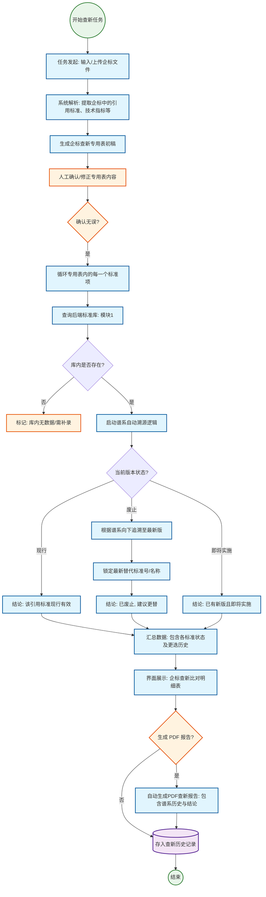

# 查新服务模块：界面规划说明

本文档依据「查新任务」业务流程图（任务发起、解析与专用表初稿、人工确认、逐条查库与溯源、三态结论、汇总展示、PDF 报告与归档）与《标准化信息服务平台——需求分析文档》第 8.2 节整理。**主流程 Mermaid 图与补充说明见第 2.1～2.3 节。****不实现合规模块界面**；流程图中「查询后端标准库 / 模块1」为后端行为，前端仅在比对明细中展示结果。**与后端路径的对照见第 8 节**，详见《[后端接口说明文档.md](../../后端接口说明文档.md)》。

---

## 1. 模块目标与范围

### 1.1 目标

支持管理员发起查新任务：上传企标或输入待查信息 → 系统解析并生成**企标查新专用表初稿** → 人工确认或修正 → 对专用表内每条引用标准执行库内查询与谱系溯源 → 展示现行/废止（含替代建议）/即将实施等结论 → 汇总为**查新比对明细表** → 可选生成 **PDF 报告** → 任务进入历史归档。

### 1.2 本期不包含

- 与合规评价、仪表盘、其他模块的跳转与参数衔接。
- 标准库管理页面本体（数据维护在 `/standard-library`）。
- 具体 PDF 引擎与模板字段（前端预留预览与下载入口）。

---

## 2. 业务流程对齐

| 流程图节点 | 含义 | 界面落点 |
|------------|------|----------|
| Start | 开始查新任务 | `/novelty-search/create` 或列表页「新建」 |
| Upload | 任务发起：输入/上传企标 | 创建页：文件上传区或标准号/表单输入 |
| PDFParsing | 解析引用标准、技术指标等 | 任务详情页「解析中」阶段；进度展示 |
| GenDraftTable | 生成专用表初稿 | 任务详情「专用表」Tab，初稿可编辑 |
| HumanAudit | 人工确认/修正 | 同上，表格内编辑与批注 |
| ConfirmTable | 确认无误？ | 显式按钮「确认专用表并进入比对」；未确认禁止进入比对（或后端控制） |
| LoopStart / QueryM1 | 逐条查询标准库 | 后端循环；前端在「比对明细」展示每行状态 |
| Exists | 库内是否存在 | 行状态：存在 / 不存在；不存在 → ManualHandle |
| ManualHandle | 标记需补录等 | 行内 Tag、操作「标记已补录」或备注（以后端为准） |
| TraceLogic / StatusMatch | 谱系溯源与三态 | 比对列：现行 / 废止 / 即将实施 |
| ResultActive / ResultObsolete / ResultIncoming | 三类结论文案 | 每行结论列 + 废止时的替代标准号/名称 |
| FollowPedigree / FindNext | 废止后向下追溯 | 展示在结论区或展开行 |
| DataCompile | 汇总数据 | 汇总区或明细表底部统计（可选） |
| UIRender | 查新比对明细表 | 任务详情核心表格 |
| ReportGen / PDFGen | 是否生成 PDF | 按钮「生成报告」；生成中状态 |
| Archive | 历史记录 | 任务列表或独立历史视图展示已完成任务 |
| End | 结束 | 成功态、返回列表 |

### 2.1 业务流程图（Mermaid 原图）

下列图为模块主流程的权威表述（与上表节点名一致）。**三态结论汇入汇总**在图中合并为多条边指向同一节点，便于各类 Mermaid 渲染器解析。

### 2.2 原图与界面落点的对照说明（细化）

| 流程节点 | 界面侧应呈现的能力要点 |
|----------|------------------------|
| **Start / Upload** | 列表「新建」+ 创建页双通道（上传企标 / 无文件时表单录入）；校验、取消草稿、提交后进入 `taskId` 工作台。 |
| **PDFParsing / GenDraftTable** | 任务详情步骤「解析中」+ 专用表 Tab 展示初稿；解析进度与异常摘要（失败时见 §2.3）。 |
| **HumanAudit / ConfirmTable** | 专用表可编辑、批注；显式「确认专用表并进入比对」；**选「否」**须留在本环节（见 §2.3 闭环）。 |
| **LoopStart / QueryM1** | 比对明细与专用表行映射；行级「查询中/已完成」；后端循环或批量接口，前端展示进度 `n/N`。 |
| **Exists** | 库内无数据 → 行状态 + ManualHandle 操作（备注、标记已补录、跳转标准库说明等）。 |
| **TraceLogic / StatusMatch / 三 Result** | 比对列展示三态结论；废止链展示 **FollowPedigree → FindNext** 的结果（替代号/名称）；可展开谱系摘要（对齐标准库只读能力）。 |
| **DataCompile / UIRender** | 汇总统计区 + 主表格筛选/导出；与专用表行**双向定位**（可选增强）。 |
| **ReportGen / PDFGen / Archive** | 是否生成 PDF 的显式选择；生成中态、预览与下载；入库历史列表筛选（见 §2.3「跳过报告仍归档」）。 |

### 2.3 流程补充说明（在原图基础上的显式分支）

原图主干已覆盖「发起 → 解析与专用表 → 确认 → 库内查询与溯源 → 三态 → 汇总表 → 可选 PDF → 归档」。下列为**建议写入实现与联调清单**的补充，**不推翻原流程**，仅补全工程与产品上常见缺口：

1. **解析失败（PDFParsing）**  
   - 增加出口：**失败 →** 允许「重试上传 / 改为手工录入 / 结束任务」；界面与「确认无误」并行，避免解析卡死无出口。

2. **ConfirmTable 为「否」**  
   - 显式回到 **HumanAudit / GenDraftTable** 侧（箭头语义：未确认不进入 `LoopStart`）；界面需支持多次确认前修订，并可记录「确认/撤回」审计（若后端提供）。

3. **ReportGen 为「否」**  
   - **仍应进入 Archive**：比对与汇总已完成时，允许用户跳过 PDF，任务仍归档为已完成（无报告或报告字段为空）；与「生成 PDF」路径在 **Archive** 前汇合。

4. **PDFGen 失败**  
   - 任务可标记为「比对完成、报告失败」，允许**单独重试生成报告**，不要求回滚比对结果。

5. **比对中断 / 部分行失败**  
   - 支持行级或整批重试（依赖后端）；界面展示失败原因列，避免仅整任务失败。

6. **Exists 的细粒度（可选）**  
   - 「存在但元数据不全」等与后端约定子状态，避免 Exists 二值过粗导致误判。

7. **StatusMatch 兜底（可选）**  
   - 溯源异常或冲突时的 **未知/待核定** 态，避免强行归入现行/废止/即将实施。

8. **幂等与并发**  
   - 「确认并进入比对」「生成报告」等操作防重复提交；长任务可取消策略与后端对齐。

9. **权限与审计（可选节点）**  
   - 关键动作（确认专用表、标记补录、生成报告）记录操作者与时间，便于质检与追责。

---

## 3. 信息架构与路由

### 3.1 建议路由

| Path | 说明 |
|------|------|
| `/novelty-search` | 任务列表（我发起的 / 全部，视权限） |
| `/novelty-search/create` | 新建任务 |
| `/novelty-search/tasks/:taskId` | 单任务工作台（解析、专用表、比对、报告） |

可选：`/novelty-search/history` — 若与列表字段重复，可合并为列表的「状态=已完成」筛选。

### 3.2 任务详情页信息架构

建议顶部 **`Steps`** 或 **`Steps` + 状态 Tag**：排队 → 解析中 → 待确认专用表 → 比对中 → 已完成 / 失败。

**Tab 建议**：

1. **专用表与确认**：初稿表格、编辑、确认按钮。
2. **比对明细**：每引用标准一行：是否存在、溯源结论、三态、替代信息、异常标记。
3. **报告与历史**：生成 PDF、预览、下载；本任务时间线（可选）。

---

## 4. 界面清单（按页面）

### 4.1 任务列表 `/novelty-search`

- **功能**：分页列表；状态筛选；关键字（任务号、企业名等，视后端）；进入详情。
- **操作**：新建任务、刷新、进入详情。
- **状态列**：建议与流程一致：排队、解析中、待确认、比对中、已完成、失败。
- **空态**：无任务时引导去「新建」。
- **失败任务**：行内显示失败原因摘要，详情可看完整信息。

### 4.2 新建任务 `/novelty-search/create`

- **功能**：上传企标 PDF **或** 输入标准号/约定字段（与后端契约一致）；提交创建任务。
- **布局**：**Tab**（上传文件 | 仅标准号）或**分步表单**，避免两种源混淆。
- **校验**：文件类型、大小；必填项校验。
- **提交后**：跳转至 `/novelty-search/tasks/:taskId` 或先回列表并提示「任务已创建」。

### 4.3 任务详情 `/novelty-search/tasks/:taskId`

- **专用表 Tab**：可编辑表格（引用标准号、名称、备注等）；「确认无误」前可保存草稿（若后端支持）。
- **比对明细 Tab**：只读为主，突出「库内无数据」与「废止→替代」行；支持展开查看谱系摘要。
- **报告 Tab**：生成按钮、预览区（iframe/pdf 占位）、下载；仅完成后可用或按后端状态禁用。
- **异步**：解析、比对、生成 PDF 过程中顶部或区块内 **`Progress` + 文案**，禁止阻塞整页交互（可禁用仅相关按钮）。

### 4.4 历史（若独立）

- 与列表合并时可省略；否则为只读列表 + 下载入口。

---

## 5. 布局与组件级建议

| 场景 | 建议 |
|------|------|
| 专用表 | `ProTable` 可编辑行或 `Form.List`；列较多时用横向滚动 |
| 比对明细 | `ProTable` + 行展开（`expandable`）展示谱系/替代详情 |
| 长耗时 | 轮询或 WebSocket 以产品为准；UI 上保持进度可见 |
| PDF | 新窗口预览或 Tab 内嵌；移动端可仅下载 |

---

## 6. 权限与可见性

- 操作员与超管均可发起查新（若业务限制仅某角色，以后端为准）。
- 删除任务、作废报告（若有）需 **二次确认**。

---

## 7. 非功能与体验

- **5 秒以上任务**（需求 10.1）：必须异步 + 进度反馈，禁止无提示长时间等待。
- **错误恢复**：失败任务支持「重试」或「复制为新任务」（以后端能力为准）。
- **专用表未确认**：进入比对前强提示，避免误操作。

---

## 8. 后端接口对照（摘自《后端接口说明文档》）

下列接口可用于支撑**查新相关界面**（选标准、单条/批量溯源、企标上传解析、谱系展示）。说明文档**未描述**独立的「查新任务」资源（如 `GET /api/novelty-tasks/{id}/`）——任务列表、状态机、PDF 报告落库等若需 REST，要向后端确认或依赖 WebSocket/轮询既有异步任务。

### 8.1 标准库侧：单条溯源与批量比对

| 方法 | 路径 | 用途（界面落点） | 备注 |
|------|------|------------------|------|
| GET | `/api/standards/check-latest/` | 对**单条**引用标准判断是否最新、`pedigree_chain` | Query：**必填** `bz_id`；成功体无统一 `code` 包装 |
| POST | `/api/standards/batch-fuzzy-check/` | **批量**关键字查新/模糊匹配 | Body：`{ "keywords": ["…"] }`；每行 `isLatest`/`latestId`/`error` |
| GET | `/api/standards/basic-search/` | 录入标准号/名称时的联想与候选 | Query：`q` |
| GET | `/api/get_tree_data/` | 比对明细中展示**族谱节点与边** | Query：**必填** `bz_id` |

### 8.2 企标文件与引用链（异步）

| 方法 | 路径 | 用途（界面落点） | 备注 |
|------|------|------------------|------|
| POST | `/api/analyze_qb_references_auto/` | 上传**企标 PDF/DOCX**，移交后台 AI 解析 | `multipart`：`file`；依赖 Redis/Celery；成功仅表示入队 |
| POST | `/api/insert_anti_warn/` | 将规范性引用列表编入映射（JSON：`source_bz_id`、`references[]` 等） | 若查新流程在确认后需**写回引用链**，可对齐此接口 |

### 8.3 实时推送（WebSocket）

| 资源 | 用途 | 备注 |
|------|------|------|
| `ws://<host>/ws/dify_results/` | 解析/合规等异步结果推送 | 文档列 `compliance_eval`、`preface_highlights` 等 `type`；**查新上传**若与同一管道共用，需在 `onmessage` 按 `type` 分支 |

### 8.4 文档中未覆盖的查新产品缺口（需联调确认）

- **任务列表 / 任务详情 / taskId**：未在 HTTP 章节给出明确路径。
- **专用表初稿的 GET/PATCH**：未单独列出；可能由分析任务结果经 WebSocket 返回 JSON，需对照后端实现。
- **查新 PDF 报告生成**：未列出专用下载路径；若与合规导出共用，见标准库文档中的 `export-report`（属性为合规审查 Excel，非查新 PDF 时需另找接口）。

---

## 附录：任务详情 Tab 与流程对应

