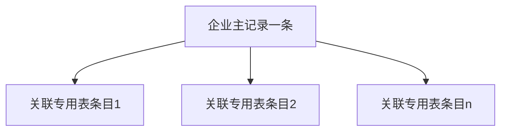

# 企业档案模块：界面规划说明

本文档依据《标准化信息服务平台——需求分析文档》中 **「一企一库」**（企业维度一条核心主记录，动态关联企标专用表等）与成员五开发约定整理。**未提供单独业务流程图**；本模块聚焦档案维护与主从展示，与预警、合规、查新的联动不在本期展开。**后端接口现状见第 8 节**，《[后端接口说明文档.md](../../后端接口说明文档.md)》当前版本**未提供**独立企业档案 REST。

---

## 1. 模块目标与范围

### 1.1 目标

为每个合作企业维护 **唯一企业档案主记录**，并集中展示与该企相关的 **关联数据入口**（如企标专用表列表、文档列表等，字段与接口以后端为准）。支撑「一企一库」的管理与查阅，为后续监控、预警类功能提供档案基础。

### 1.2 本期不包含

- 跳转到预警、合规、查新详情页及参数传递。
- 专用表、企标的技术比对逻辑（非本模块 UI 职责）。
- 与成员二、四的字段命名对齐（另迭代）。

---

## 2. 业务流程对齐

本模块无独立流程图，下列为**概念层步骤**与界面映射。

| 业务概念 | 含义 | 界面落点 |
|----------|------|----------|
| 建立企业主档 | 创建一条企业核心记录 | `/enterprise-archive/create`（若启用）或后台导入后前端仅编辑 |
| 检索企业 | 按名称、编号、状态等查找 | `/enterprise-archive` 列表筛选 |
| 查看一企一库 | 主档 + 关联列表 | `/enterprise-archive/:id` |
| 维护主档信息 | 修改联系方式、资质等 | 详情页编辑模式或独立「编辑」页 |
| 关联专用表 | 展示该企业下专用表条目 | 详情 Tab「关联专用表」 |
| 扩展关联 | 其他文档、任务摘要等 | 预留 Tab，占位或只读 |

---

## 3. 信息架构与路由

### 3.1 建议路由

| Path | 说明 |
|------|------|
| `/enterprise-archive` | 企业列表 |
| `/enterprise-archive/create` | 新建企业（可选；若企业仅由导入产生可去掉） |
| `/enterprise-archive/:enterpriseId` | 企业档案详情（一企一库） |

`enterpriseId` 建议使用与后端一致的主键或业务编号，类型以接口为准。

### 3.2 详情页 Tab 建议

1. **基本信息**：工商/档案类主数据，`Descriptions` + 编辑入口。
2. **关联专用表**：表格列表（只读或可跳转占位，本期可不实现跳转）。
3. **其他**（可选）：附件、备注、变更记录占位。

后续若产品增加「子路由」，可采用 `/enterprise-archive/:id/special-tables` 等 kebab-case，与成员五文档约定一致。

---

## 4. 界面清单（按页面）

### 4.1 企业列表 `/enterprise-archive`

- **功能**：分页列表；搜索（企业名称、统一社会信用代码等，以后端为准）；状态筛选。
- **操作**：新建（若有）、查看详情、导出列表（若开放，需权限与确认）。
- **空态**：无企业时引导创建或说明导入渠道。
- **行操作**：主操作「进入档案」。

### 4.2 新建企业 `/enterprise-archive/create`（可选）

- **功能**：分区表单：基本信息、联系信息、备注等。
- **操作**：提交、取消；提交成功跳转详情或列表。
- **校验**：必填、格式（电话、邮箱等）。

### 4.3 企业详情 `/enterprise-archive/:id`

- **功能**：顶部展示企业名称与关键状态 **Tag**；**Descriptions** 展示主档字段。
- **关联专用表**：内嵌 `Table` 或子路由；列：专用表标识、关联标准、更新时间、状态等（以后端为准）。
- **操作**：编辑主档、刷新关联列表；删除企业（若开放，**Modal.confirm** + 强提示）。
- **空关联**：专用表 Tab 空态说明「暂无数据」。

---

## 5. 布局与组件级建议

| 区域 | 建议 |
|------|------|
| 列表页 | `ProTable` + 折叠搜索表单 |
| 详情顶栏 | `PageHeader` 或自定义：标题 + 返回 + 编辑 |
| 主档 | `Card` + `Descriptions`；编辑用 `Drawer` 或路由到 `.../edit` |
| 关联表 | `Table` 分页；列多时使用 `scroll.x` |

---

## 6. 权限与可见性

- 创建/删除/导出等企业级敏感操作以后端角色为准；前端对无权限按钮 **隐藏或禁用**，并以接口 403 为最终依据。
- 企业联系方式等若属敏感字段，可采用默认折叠或仅超管可见（产品定）。

---

## 7. 非功能与体验

- 详情页加载使用 **Skeleton**；关联表独立请求失败时不拖垮整页，用 **Alert** 提示。
- 为后续衔接预留 **扩展 Tab** 或「相关模块」占位区，避免后期大改布局。

---

## 8. 后端接口对照（摘自《后端接口说明文档》）

**详细展开**（弱相关接口、待补充建议契约、与前端 Mock 关系）：[企业档案模块-后端可用接口与待补充说明.md](./企业档案模块-后端可用接口与待补充说明.md)

### 8.1 直接支撑「企业档案」主界面

| 说明 |
|------|
| 现行《后端接口说明文档》**未列出**形如 `/api/enterprises/`、`/api/companies/` 的 **企业主档 CRUD** 或「一企一库」列表接口。本模块规划的列表页、详情页、新建页**暂无官方 REST 对照**，实现前需向后端确认数据模型与路径，或暂时仅做 **Mock / 占位**。 |

### 8.2 弱相关接口（非企业主档，仅作关联数据参考）

下列接口涉及 **企标号**、引用或预警，**不能**替代企业档案主数据，联调时勿与「企业 ID / 统一社会信用代码」混淆。

| 方法 | 路径 | 与「企业」关系 |
|------|------|----------------|
| POST | `/api/mapping/save/` | Body 含 `enterprise_bz_id`（**企标标准号**）与 `national_bz_id` 映射，非企业工商档案 |
| GET | `/api/standards/warning-trace/` | 返回 `affected_enterprises` 为**企标号**列表示例，非企业库查询 |
| POST | `/api/insert_anti_warn/` | `source_bz_id` 等为企标侧数据 |

### 8.3 后续建议

- 与后端约定 **企业实体** 的主键、列表筛选字段、与 `StdBase`/专用表的关联方式后，在本节增补表格并同步 `services/enterprise-archive.ts`。

---

## 附录：一企一库概念示意

